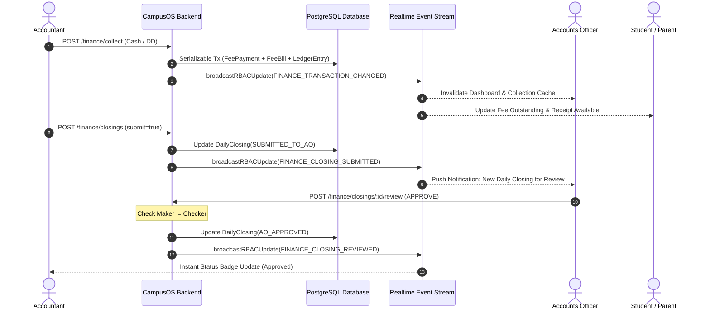

# GEETORUS CampusOS — AO & Accountant Realtime Synchronization Report

## 1. Distinct Role Separation & Workflow Boundaries

| Capability / Responsibility | Accountant (`ACCOUNTANT`) | Accounts Officer (`AO` / `ACCOUNTS_OFFICER`) |
|---|---|---|
| **Primary Focus** | Daily Operations, Collections & Transactions | Financial Governance, Approvals & Audits |
| **Fee Collection** | Records Cash, Cheque, DD, UPI & POS Offline Payments | Views Aggregated Inflow & Reconciliation |
| **Receipt Generation** | Issues Official Receipts & Transaction IDs | Audits Generated Receipts & Vouchers |
| **Daily Closings** | Prepares, tallies cash count & Submits Day Closing | Reviews, Approves, Queries, or Returns Day Closings |
| **Maker-Checker Requests** | Submits Refund, Waiver, Concession, Reversal Requests | Sole Approver / Checker for Financial Adjustments |
| **Self-Approval** | **STRICTLY BLOCKED** by Server | **STRICTLY BLOCKED** if AO originated the request |
| **Budget Allocations** | Views department expense caps | Reviews & sanctions department budget proposals |

---

## 2. Single Canonical Ledger Mechanics

The single source of truth for every student's financial standing is governed by the invariant mathematical equation:

$$\text{Outstanding Balance} = \text{Opening} + \text{Charges} - \text{Scholarship} - \text{Concession} - \text{Waiver} - \text{Payments} + \text{Fine} \pm \text{Adjustments}$$

* **Immutable Reversals**: Mistakes are never solved with `DELETE` queries. Compensating `REVERSAL` journal entries (`direction: DEBIT/CREDIT`, `sourceType: REVERSAL_ENTRY`) are inserted to preserve complete GAAP-compliant audit trails.

---

## 3. Realtime Invalidation Pipeline & SSE Event Channel

