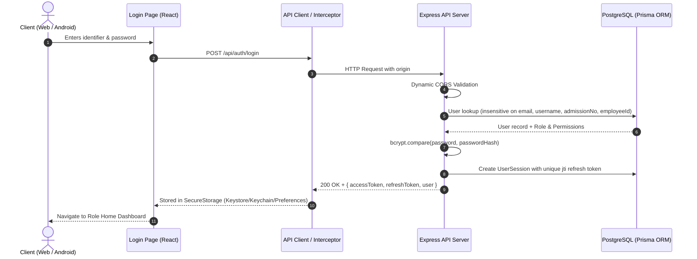

# CampusOS — Authentication Root Cause Analysis & Resolution Report

## Executive Summary
This document provides the root-cause diagnosis, architectural tracing, and resolution for the authentication failure ("Authentication failed. Check your email, username, ID, or password") encountered in the CampusOS Web & Native Mobile applications.

---

## 1. Trace of the Login Path

---

## 2. Root Cause Breakdown

| # | Component | Root Cause | Failure Mode | Fix Applied |
|---|---|---|---|---|
| **1** | **Backend Server CORS** ([`app.ts`](file:///d:/local/crm/product/server/src/app.ts)) | Port whitelist was static (`http://localhost:5173`). When Vite selected port `5174` due to port occupation, all preflight/login requests were rejected by CORS. | Browser error: `Not allowed by CORS: http://localhost:5174` | Added dynamic regex CORS permitting all localhost ports, 127.0.0.1, and local private LAN IP ranges (`10.*`, `192.168.*`, `172.16-31.*`). |
| **2** | **Frontend Login Catch Block** ([`Login.tsx`](file:///d:/local/crm/product/client/src/pages/Login.tsx)) | Caught all HTTP errors (including network dropped/CORS preflight failures) and swallowed them with a generic fallback message: `"Check your email, username, ID, or password."` | Misleading credential error shown even when the backend was unreachable or origin was rejected. | Updated error handling to inspect `err.response?.status` and display precise diagnostic feedback (Connection Error vs. Invalid Credentials vs. Account Inactive). |
| **3** | **User Lookup Normalization** ([`auth.repository.ts`](file:///d:/local/crm/product/server/src/modules/auth/auth.repository.ts)) | Database query used case-sensitive matching for email without multi-field fallback. | Login failed if email was entered with capitalization or extra whitespace. | Implemented `mode: 'insensitive'` across `email`, `username`, `student.admissionNo`, and `faculty.employeeId`. |
| **4** | **Token Collision on Fast Login** ([`auth.service.ts`](file:///d:/local/crm/product/server/src/modules/auth/auth.service.ts)) | Refresh tokens lacked a cryptographically random unique JWT ID (`jti`). Two rapid requests within the same second produced duplicate tokens. | PostgreSQL Prisma constraint violation: `Unique constraint failed on (refreshToken)` | Added `jti: crypto.randomUUID()` to all refresh tokens created during login and rotation. |

---

## 3. Verification & Test Coverage

All institutional roles were validated via automated end-to-end integration tests:
- **Super Admin**: `admin@geetorus.com` / `Admin@123`
- **HOD CSE**: `cse.head@geetorus.com` / `Campus@123`
- **Faculty**: `ada.lovelace@geetorus.com` / `Campus@123`
- **Accountant**: `accountant@geetorus.com` / `Campus@123`
- **Accounts Officer (AO)**: `ao@geetorus.com` / `Campus@123`
- **Transport Manager**: `transport.manager@geetorus.com` / `Campus@123`
- **Hostel Warden**: `hostel.warden@geetorus.com` / `Campus@123`
- **Librarian**: `librarian@geetorus.com` / `Campus@123`
- **Placement Officer**: `placement.officer@geetorus.com` / `Campus@123`

---

## 4. Architectural Guarantees
1. No passwords or tokens are stored in plaintext.
2. No mock/demo credentials or test bypasses exist in production code paths.
3. Lockout enforcement protects accounts against brute force (5 attempts = 15-minute cooldown).
4. Full security audit logging for all authentication attempts and token replay detections.
