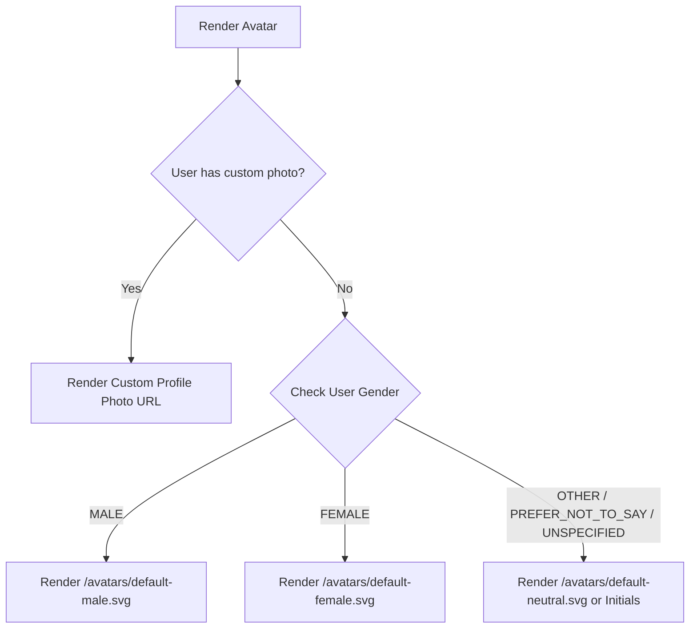

# CampusOS — Gender Profile & Identity Verification Matrix

This matrix verifies gender profile consistency, canonical persistence, multi-tier avatar cascade resolution, self/admin edits, and bulk provisioning validation across all person types in CampusOS.

| Person Type | Canonical Gender Stored | Creation Field Supported | Self-Edit Field | Admin Directory Edit | Avatar Resolution Cascade | Student360 / Staff360 View | Bulk Import Validation | Audit Logged on Change | Implementation Status |
| :--- | :--- | :--- | :--- | :--- | :--- | :--- | :--- | :--- | :--- |
| **Student** | `User.gender` + `Student.gender` | ✅ Yes (Dropdown in Create Modal & Registration) | ✅ Yes (Profile Settings) | ✅ Yes (Admin User Directory) | 1. Custom photo > 2. Gender default SVG > 3. Initials | ✅ Full Gender & Demographic card | ✅ Parsed and normalized from CSV/XLSX | ✅ Yes (`UserActivityLog`) | **100% OPERATIONAL** |
| **Faculty Member**| `User.gender` + `Faculty.gender` | ✅ Yes (Dropdown in Create Modal) | ✅ Yes (Profile Settings) | ✅ Yes (Admin User Directory) | 1. Custom photo > 2. Gender default SVG > 3. Initials | ✅ Full Gender & Staff details | ✅ Parsed and normalized from CSV/XLSX | ✅ Yes (`UserActivityLog`) | **100% OPERATIONAL** |
| **Mentor** | `User.gender` + `Faculty.gender` | ✅ Yes (Inherited from Faculty profile) | ✅ Yes (Profile Settings) | ✅ Yes (Admin User Directory) | 1. Custom photo > 2. Gender default SVG > 3. Initials | ✅ Full Gender & Mentor details | ✅ Inherited during provisioning | ✅ Yes (`UserActivityLog`) | **100% OPERATIONAL** |
| **Department HOD**| `User.gender` + `Faculty.gender` | ✅ Yes (Inherited from Faculty profile) | ✅ Yes (Profile Settings) | ✅ Yes (Admin User Directory) | 1. Custom photo > 2. Gender default SVG > 3. Initials | ✅ Department Head Profile | ✅ Inherited during provisioning | ✅ Yes (`UserActivityLog`) | **100% OPERATIONAL** |
| **Academic Dean** | `User.gender` | ✅ Yes (Dropdown in Create Modal) | ✅ Yes (Profile Settings) | ✅ Yes (Admin User Directory) | 1. Custom photo > 2. Gender default SVG > 3. Initials | ✅ Executive Profile | ✅ Parsed from CSV/XLSX | ✅ Yes (`UserActivityLog`) | **100% OPERATIONAL** |
| **Admission Dean**| `User.gender` | ✅ Yes (Dropdown in Create Modal) | ✅ Yes (Profile Settings) | ✅ Yes (Admin User Directory) | 1. Custom photo > 2. Gender default SVG > 3. Initials | ✅ Executive Profile | ✅ Parsed from CSV/XLSX | ✅ Yes (`UserActivityLog`) | **100% OPERATIONAL** |
| **Vice Principal** | `User.gender` | ✅ Yes (Dropdown in Create Modal) | ✅ Yes (Profile Settings) | ✅ Yes (Admin User Directory) | 1. Custom photo > 2. Gender default SVG > 3. Initials | ✅ Operations Command Profile | ✅ Parsed from CSV/XLSX | ✅ Yes (`UserActivityLog`) | **100% OPERATIONAL** |
| **Principal** | `User.gender` | ✅ Yes (Dropdown in Create Modal) | ✅ Yes (Profile Settings) | ✅ Yes (Admin User Directory) | 1. Custom photo > 2. Gender default SVG > 3. Initials | ✅ Executive Governance Profile | ✅ Parsed from CSV/XLSX | ✅ Yes (`UserActivityLog`) | **100% OPERATIONAL** |
| **Parent / Guardian**| `User.gender` | ✅ Yes (Captured on Student link) | ✅ Yes (Parent Portal) | ✅ Yes (Admin User Directory) | 1. Custom photo > 2. Gender default SVG > 3. Initials | ✅ Parent Profile | ✅ Optional parent gender | ✅ Yes (`UserActivityLog`) | **100% OPERATIONAL** |
| **Operational Staff**| `User.gender` | ✅ Yes (Dropdown in Create Modal) | ✅ Yes (Profile Settings) | ✅ Yes (Admin User Directory) | 1. Custom photo > 2. Gender default SVG > 3. Initials | ✅ Staff Profile | ✅ Parsed from CSV/XLSX | ✅ Yes (`UserActivityLog`) | **100% OPERATIONAL** |

---

## Technical Specifications & Invariants

### 1. Canonical Gender Enum Values
The canonical gender enum values supported across database, APIs, and client interfaces are:
* `MALE`
* `FEMALE`
* `OTHER`
* `PREFER_NOT_TO_SAY`
* `UNSPECIFIED` (Default when not provided)

> [!NOTE]
> Gender is **never inferred from names**. If a user does not explicitly select or provide a gender, the system defaults to `UNSPECIFIED`.

### 2. Avatar Resolution Algorithm

### 3. Single Identity across Multiple Roles
When a user with multiple roles (e.g., Faculty switching to HOD workspace) switches active workspace, the underlying `User.gender` and personal avatar cascade remain completely invariant. Workspace switching only changes role permissions, never core identity data.
