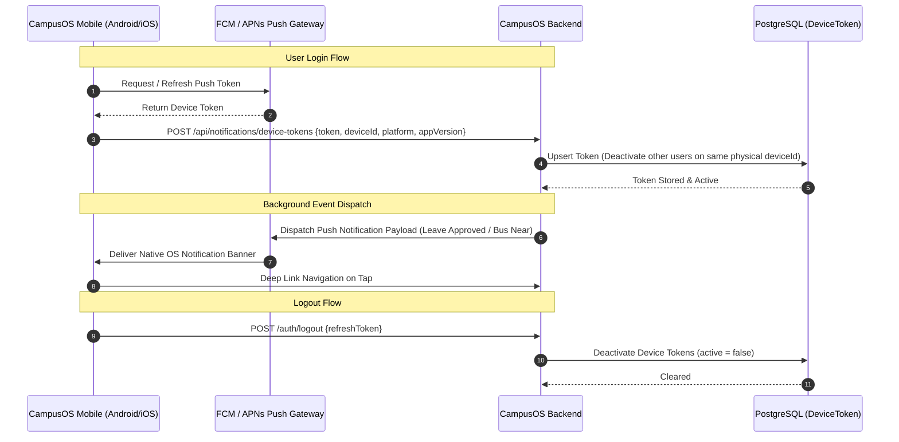

# CampusOS — Mobile Permissions & Native-First Notification Policy Matrix

## Overview
This document defines the canonical permission model, push notification architecture, and privacy enforcement policies across Web, Android, and iOS platforms for CampusOS.

---

## 1. Platform Permission Strategy

| Capability | Web Browser | Android (Native) | iOS (Native) | Request Timing | Justification / Flow |
| :--- | :--- | :--- | :--- | :--- | :--- |
| **Push Notifications** | Web Push API (VAPID / FCM) | `android.permission.POST_NOTIFICATIONS` (Android 13+) | APNs Authorization (`UNUserNotificationCenter`) | After initial login / onboarding | Delivers leave approvals, circulars, fee deadlines, bus alerts even when app is terminated. Handled gracefully if denied. |
| **Camera / QR Scanner** | `navigator.mediaDevices.getUserMedia` | `android.permission.CAMERA` | `NSCameraUsageDescription` | **Just-in-Time** (when user taps "Scan QR" or "Scan Doc") | Scanning student / faculty ID cards, event attendance, document uploads. Never on app start. |
| **Microphone / Voice** | `navigator.mediaDevices.getUserMedia({ audio: true })` | `android.permission.RECORD_AUDIO` | `NSMicrophoneUsageDescription` | **Just-in-Time** (when user taps "Record Voice Note") | Voice notes in tasks / circulars. Never in background. |
| **Location (Driver GPS)** | Geolocation API | `ACCESS_FINE_LOCATION` / `ACCESS_COARSE_LOCATION` | `NSLocationWhenInUseUsageDescription` | **Just-in-Time** (Driver app / route start) | Broadcasts live vehicle GPS coordinates from assigned transport drivers. |
| **Location (Passenger Bus Tracking)** | **NOT REQUIRED** | **NOT REQUIRED** | **NOT REQUIRED** | **None** | **Zero-abuse guarantee**: Students, faculty, and parents view bus location via vehicle telemetry without sharing phone GPS. |
| **Storage & Photos** | Standard HTML `<input type="file">` | Android Photo Picker / Scoped Storage | iOS Photo Picker (`PHPickerViewController`) | **Just-in-Time** (system picker) | Scoped file selection without `MANAGE_EXTERNAL_STORAGE` or `READ_MEDIA_IMAGES` disk scanning. |
| **Biometric Lock** | WebAuthn (optional) | `USE_BIOMETRIC` / Android BiometricPrompt | `NSFaceIDUsageDescription` / LocalAuthentication | Opt-in via Settings | Fingerprint / Face ID lock on app resume. Local device authentication only. |

---

## 2. Push Notification Life-Cycle & Multi-User Isolation

---

## 3. App Resume Sync State

When the native mobile app returns to the foreground (`campusos_app_foreground` / `appStateChange: active`):
1. **Unread Counters & Badge Summary**: Calls `/api/notifications/badges?role={currentRole}`.
2. **Notification Inbox**: Fetches latest 20 notifications (`/api/notifications?page=1`).
3. **Workflow Approvals**: Updates badge counters for pending leaves, OD requests, and task assignments.
4. **Transport Trip Status**: If passenger is allocated to an active bus route, fetches latest vehicle GPS coordinates.

---

## 4. Settings & Device Control

- **Personal Settings -> Notifications**:
  - Displays real-time OS permission state (`Authorized`, `Blocked`, `Not Enabled`).
  - Action button: `[Enable Push Notifications]` triggers native OS dialog.
  - Native Fallback: `[Open Device Settings]` launches system app settings if notifications were previously disabled at the OS level.
  - Self-Test: `[Send Test Alert]` dispatches an immediate test push to verify round-trip delivery.
