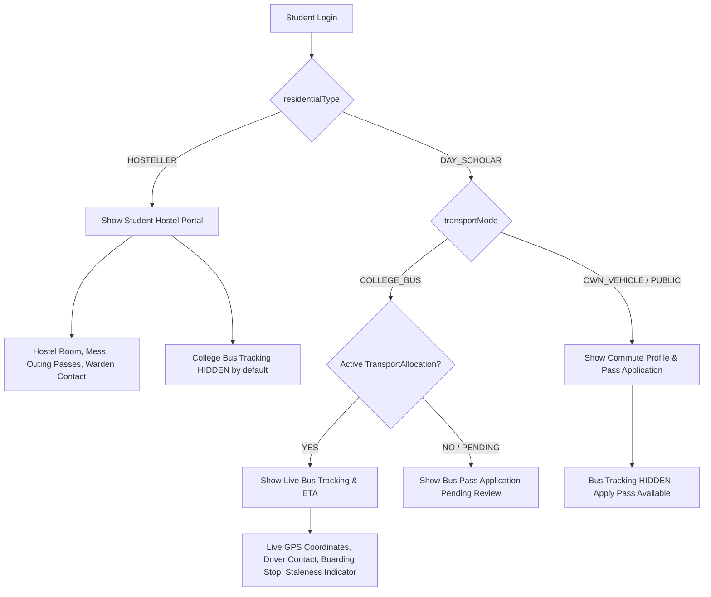

# GEETORUS CampusOS — Operational Modules & Live Synchronizations Audit

## Executive Summary
This comprehensive audit verifies the complete operational suite, canonical identity models, live GPS transport tracking, maker-checker financial controls, role-scoped mobile application launcher, and real-time Server-Sent Events (SSE) synchronization.

---

## 1. Operational Modules Implementation Status

| Operational Module | Server Router / Controller | Client Workspace | Role Guards / Scope | Live Sync / Event |
|---|---|---|---|---|
| **Transport & Bus Tracking** | `/api/transport` | `StudentTransport.tsx`, `/transport` | `TRANSPORT_MANAGER`, `STUDENT`, `PARENT` | `VEHICLE_LOCATION_UPDATED`, `TRANSPORT_ALLOCATION_CHANGED` |
| **Hostel Management** | `/api/hostel` | `StudentHostelPortal.tsx`, `/hostel` | `HOSTEL_WARDEN`, `STUDENT` | `HOSTEL_ROOM_ALLOCATED`, `OUTING_APPROVED` |
| **Finance (Accountant)** | `/api/finance` | `FinanceWorkspace.tsx` (`/accountant/dashboard`) | `ACCOUNTANT`, `ACCOUNTS_STAFF` | `FINANCE_TRANSACTION_CHANGED`, `FINANCE_CLOSING_SUBMITTED` |
| **Finance (AO Control)** | `/api/finance` | `FinanceWorkspace.tsx` (`/ao/dashboard`) | `ACCOUNTS_OFFICER`, `AO` | `FINANCE_CLOSING_REVIEWED`, `FINANCE_APPROVAL_COMPLETED` |
| **Campus Office** | `/api/office` | `/office` | `OFFICE`, `ADMINISTRATION_DEAN` | `CERTIFICATE_ISSUED`, `TC_APPROVED` |
| **Human Resources (HR)** | `/api/hr` | `/hr` | `HR`, `PRINCIPAL`, `SUPER_ADMIN` | `STAFF_ONBOARDED`, `LEAVE_ACCRUED` |
| **Library Management** | `/api/library` | `/library`, `/student/library` | `LIBRARIAN`, `STUDENT`, `FACULTY` | `BOOK_ISSUED`, `BOOK_RETURN_OVERDUE` |
| **Placement Engine** | `/api/placement` | `/placements`, `/student/placements` | `PLACEMENT_OFFICER`, `STUDENT` | `DRIVE_SCHEDULED`, `OFFER_RELEASED` |
| **Purchase & Procurement** | `/api/purchase` | `/purchase` | `PURCHASE_OFFICER`, `AO` | `PO_APPROVED`, `INVOICE_PROCESSED` |
| **Asset & Inventory** | `/api/inventory` | `/inventory` | `INVENTORY_MANAGER`, `AO` | `STOCK_DEPLETED`, `ASSET_AUDITED` |
| **Facility Maintenance** | `/api/maintenance` | `/maintenance` | `MAINTENANCE_MANAGER` | `WORK_ORDER_ASSIGNED`, `BREAKDOWN_REPORTED` |
| **Research & Publications**| `/api/research` | `/research` | `FACULTY`, `HOD`, `ACADEMIC_DEAN`| `PAPER_PUBLISHED`, `GRANT_SANCTIONED` |
| **Scholarships** | `/api/scholarships`| `/scholarships`, `/student/scholarships`| `ACCOUNTANT`, `AO`, `STUDENT` | `SCHOLARSHIP_AWARDED` |
| **Admissions** | `/api/admission` | `/admission` | `ADMISSION_DEAN`, `OFFICE` | `CANDIDATE_ADMITTED`, `SEAT_CONFIRMED` |
| **Alumni Relations** | `/api/alumni` | `/alumni` | `ALUMNI_OFFICER` | `REUNION_SCHEDULED`, `MENTORSHIP_LINKED` |

---

## 2. Student Type & Commute Visibility Matrix

---

## 3. AO vs. Accountant Responsibility Separation & Realtime Ledger

* **Single Canonical Ledger Equation**:
  $$\text{Opening} + \text{Charges} - \text{Scholarship} - \text{Concession} - \text{Waiver} - \text{Payments} + \text{Fine} \pm \text{Adjustments} = \text{Outstanding}$$

* **Maker-Checker Enforcement**:
  - The creator (`createdById`) of any financial request (closing, waiver, concession, refund, adjustment) is programmatically prohibited from approving their own request.
  - Server throws `ForbiddenException('Maker-Checker Violation: You cannot approve your own financial request')`.

* **Live Realtime Invalidation Pipeline**:
  - Offline payment created $\rightarrow$ Broadcasts `FINANCE_TRANSACTION_CHANGED` $\rightarrow$ Accountant, AO, and Student UI caches invalidate immediately.
  - Closing submitted $\rightarrow$ Broadcasts `FINANCE_CLOSING_SUBMITTED` $\rightarrow$ AO pending review queue refreshes immediately.
  - AO approves closing/refund $\rightarrow$ Broadcasts `FINANCE_APPROVAL_COMPLETED` $\rightarrow$ Accountant ledger balances and approval history update without page refresh or logout.
