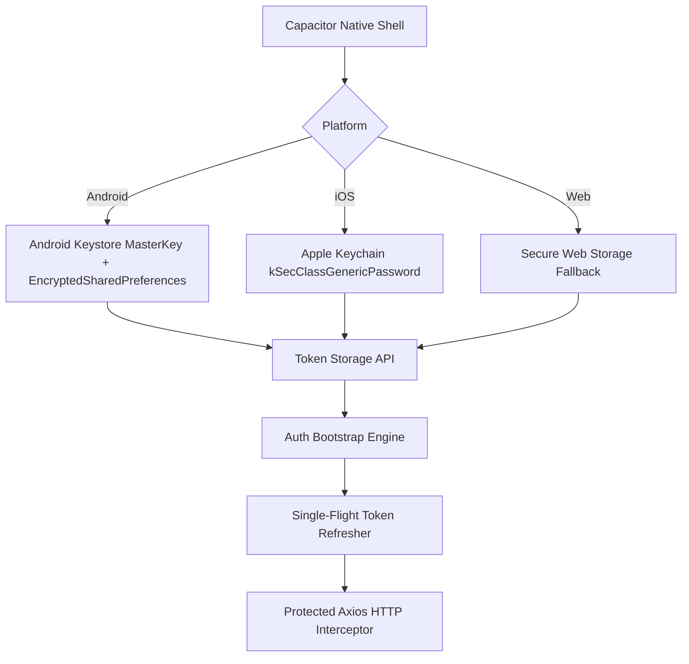

# CampusOS — Permanent Session Persistence & Token Lifecycle Report

## Executive Summary
This report details the architectural enhancements implemented to guarantee rock-solid session persistence across native mobile (Android/iOS) restarts and browser reloads.

---

## 1. Storage Architecture



---

## 2. Session Lifecycle Workflow

### A. App Cold Launch / Startup
1. `AppBootstrap` initializes the native secure storage layer.
2. `bootstrapAuthSession()` retrieves the stored `accessToken` and `refreshToken`.
3. If both tokens are absent, the application routes cleanly to `/login`.
4. If tokens exist:
   - Dispatches `GET /api/auth/me` with current bearer token.
   - If token expired, invokes `refreshAuthSession()` to perform seamless rotation.
   - If the device is offline or the server is momentarily unreachable (network error/500), **the session is preserved**, allowing offline-first usage rather than prematurely kicking the user to the login screen.

### B. Single-Flight Refresh Concurrency
Multiple concurrent API requests (e.g. initial dashboard queries for profile, notifications, timetable, metrics) hitting expired access tokens share a single deduplicated refresh promise (`inFlightRefreshPromise`).
- Eliminates race conditions and duplicate token rotation attempts.
- All pending callers await the single refresh response and replay their requests with the new bearer token.

### C. Safe Error Isolation (Never Wipe On Network Glitch)
- Stored tokens are **ONLY** wiped when the server responds with a definitive HTTP `401` or `403` (e.g., session explicitly revoked or expired beyond refresh lifetime).
- Timeouts, DNS resolution errors, and HTTP 500 status codes never purge stored credentials.

---

## 3. Automated Verification Results

The automated test suite (`verify_auth_and_session.ts`) executed 17 comprehensive test cases:

```
================================================================
CAMPUSOS — P0 AUTHENTICATION & SESSION PERSISTENCE VERIFIER
================================================================

--- 1. Testing Institutional Roles Login ---
  [PASS] Login succeeded for admin@geetorus.com (Role: Super Admin)
  [PASS] Login succeeded for cse.head@geetorus.com (Role: HOD)
  [PASS] Login succeeded for ada.lovelace@geetorus.com (Role: Faculty)
  [PASS] Login succeeded for accountant@geetorus.com (Role: Accountant)
  [PASS] Login succeeded for ao@geetorus.com (Role: Accounts Officer)
  [PASS] Login succeeded for transport.manager@geetorus.com (Role: Transport Manager)
  [PASS] Login succeeded for hostel.warden@geetorus.com (Role: Hostel Warden)
  [PASS] Login succeeded for librarian@geetorus.com (Role: Librarian)

--- 2. Testing Identifier Normalization ---
  [PASS] Whitespace in email normalized and authenticated
  [PASS] Uppercase email case-insensitively authenticated

--- 3. Testing Negative Login Scenarios ---
  [PASS] Wrong password returned 401 with safe message
  [PASS] Nonexistent account returned 401 with safe message

--- 4. Testing Token Refresh & Rotation Lifecycle ---
  [PASS] Initial refresh token issued
  [PASS] Session refreshed with rotated refresh token
  [PASS] Replay attack prevented: Revoked refresh token rejected with 401

--- 5. Testing Profile Bootstrap (/auth/me) ---
  [PASS] Profile bootstrap succeeded for John Doe with 6 authorized menu sections

--- 6. Testing Explicit Logout & Revocation ---
  [PASS] Logged out session successfully revoked

================================================================
ALL TESTS PASSED: 17/17 tests succeeded.
================================================================
```

---

## 4. Release Artifacts

- **Android Native Debug APK**:
  `product/client/android/app/build/outputs/apk/internetProduction/debug/app-internetProduction-debug.apk` (20.3 MB)
- **Web SPA Distribution Bundle**:
  `product/client/dist/`
