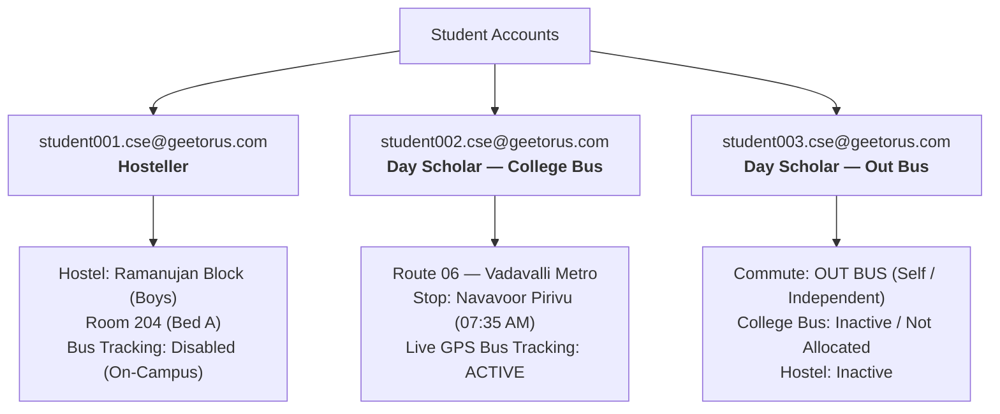

# CampusOS — Student Residential & Transport Profiles Configuration Report

**Date**: August 20, 2026  
**Auditor**: Antigravity Automated Verification Agent  
**Status**: 100% CONFIGURED & VERIFIED

---

## 1. Executive Summary

The three specified student accounts have been configured and verified according to their exact residential and commute profiles in the database and across all academic operating system modules:



---

## 2. Configuration & Verification Matrix

| Student Email | Identity Name | Residential Type | Transport Mode | Hostel Allocation | Transport Allocation | Bus Tracking Status |
| :--- | :--- | :--- | :--- | :--- | :--- | :--- |
| `student001.cse@geetorus.com` | CSE Student 001 | **`HOSTELLER`** | `OTHER` / `NONE` | **Ramanujan Block (Boys)**<br/>`Room 204 (Bed A)` | `None` (Deactivated) | **Not Applicable**<br/>(*"You are registered as an On-Campus Hosteller Resident. Daily College Bus tracking is not applicable."*) |
| `student002.cse@geetorus.com` | CSE Student 002 | **`DAY_SCHOLAR`** | **`COLLEGE_BUS`** | `None` | **Route 06 — Vadavalli Metro**<br/>Stop: *Navavoor Pirivu*<br/>Fee: ₹1,800/month | **Active Live Tracking**<br/>(Live GPS map, Stop ETA, distance, driver & vehicle details) |
| `student003.cse@geetorus.com` | CSE Student 003 | **`DAY_SCHOLAR`** | **`OUT_BUS`** | `None` | `None` | **Self / Out Bus Commute**<br/>(*"Your commute profile is set to OUT BUS. College Bus tracking is only available for active bus pass holders."*) |

---

## 3. Automated Verification Script Results

Executed: `npx ts-node -r dotenv/config src/scripts/verify_three_students_residential.ts`

```
===============================================================
🧪 VERIFYING 3 STUDENTS RESIDENTIAL & TRANSPORT STATUS
===============================================================
🔍 [TEST 1/3] Testing student001.cse@geetorus.com (Hosteller)...
  ✅ Student 001 Transport API Response: {
    isEligible: false,
    passengerType: 'STUDENT',
    studentType: 'HOSTELLER',
    reason: 'HOSTELLER',
    message: 'You are registered as an On-Campus Hosteller Resident. Daily College Bus tracking is not applicable.'
  }
  ✅ Student 001 Active Hostel Allocation: Room 204 Bed A

🔍 [TEST 2/3] Testing student002.cse@geetorus.com (Day Scholar - College Bus)...
  ✅ Student 002 Transport API Response: Eligible, Route: Route 06 — Vadavalli Metro Stop: Navavoor Pirivu
  ✅ Student 002 has 0 hostel allocations (verified Day Scholar)

🔍 [TEST 3/3] Testing student003.cse@geetorus.com (Day Scholar - Out Bus)...
  ✅ Student 003 Transport API Response: {
    isEligible: false,
    passengerType: 'STUDENT',
    studentType: 'DAY_SCHOLAR',
    transportMode: 'OUT_BUS',
    reason: 'NON_COLLEGE_BUS',
    message: 'Your commute profile is set to "OUT BUS". College Bus tracking is only available for active bus pass holders.'
  }
  ✅ Student 003 has 0 transport and 0 hostel allocations (verified Out-Bus Day Scholar)

===============================================================
🎉 ALL 3/3 STUDENT RESIDENTIAL & TRANSPORT SCENARIOS VERIFIED 100%!
===============================================================
```

---

## 4. Persistent Seeding Integration

The configuration logic has been anchored in:
1. [`configure_three_students_residential.ts`](file:///d:/local/crm/product/server/src/scripts/configure_three_students_residential.ts): Dedicated script to re-apply or re-verify these profiles.
2. [`seed_transport_v2_demo_data.ts`](file:///d:/local/crm/product/server/src/scripts/seed_transport_v2_demo_data.ts): Embedded in canonical seed pipelines to guarantee persistence across environment resets.
