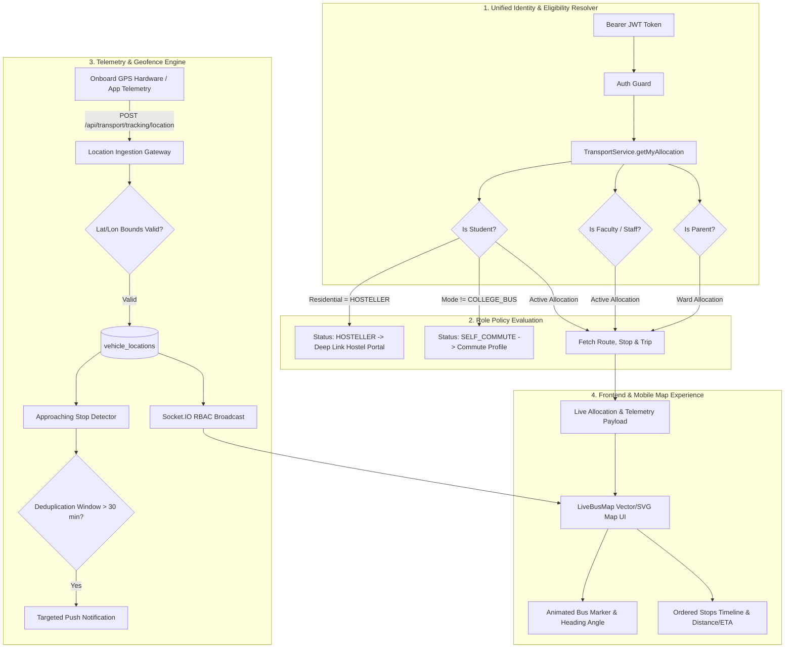
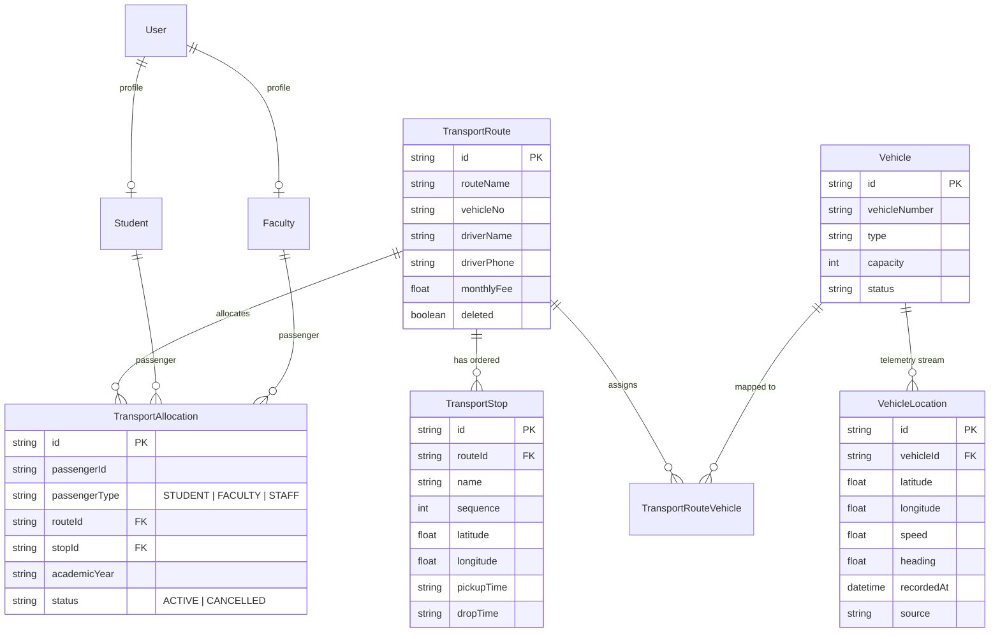

# CampusOS Transport V2 — Architecture & Real-Time Engine Specification

## 1. Executive Summary

CampusOS Transport V2 modernizes college transportation into a high-precision, real-time fleet tracking and transit management system. Built upon the foundational principle:

$$\text{Person} \longrightarrow \text{Transport Eligibility} \longrightarrow \text{Active Allocation} \longrightarrow \text{Route} \longrightarrow \text{Stop} \longrightarrow \text{Trip} \longrightarrow \text{Vehicle} \longrightarrow \text{GPS Location} \longrightarrow \text{Live Map / ETA} \longrightarrow \text{Native Push}$$

Transport V2 delivers a Google Maps-grade experience accessible across web and native mobile (Android/iOS) for **Students**, **Cross-Department Faculty & Staff**, **Parents**, and **Transport Fleet Controllers**.

---

## 2. Core Architecture Pipeline

---

## 3. Data Model & Entity Relationships

The relational architecture ensures zero duplication between academic department hierarchies and physical transportation routes.

---

## 4. Mathematical Geofencing & ETA Formulation

### 4.1 Great-Circle Distance (Haversine Formula)

Distance between vehicle coordinate $(\phi_1, \lambda_1)$ and assigned stop coordinate $(\phi_2, \lambda_2)$:

$$a = \sin^2\left(\frac{\Delta\phi}{2}\right) + \cos(\phi_1)\cos(\phi_2)\sin^2\left(\frac{\Delta\lambda}{2}\right)$$
$$c = 2 \cdot \text{atan2}\left(\sqrt{a}, \sqrt{1-a}\right)$$
$$d = R \cdot c \quad (R = 6371\text{ km})$$

### 4.2 Dynamic Speed-Adjusted ETA Estimation

$$\text{Effective Speed } v_{\text{eff}} = \max(10, \min(v_{\text{current}}, 60)) \quad [\text{km/h}]$$
$$\text{ETA (Minutes)} = \max\left(1, \text{round}\left(\frac{d}{v_{\text{eff}}} \cdot 60\right)\right)$$

### 4.3 Approaching Geofence Alert Rule

An approaching stop alert is triggered when:
$$d \le 2.5\text{ km} \quad \text{AND} \quad \text{ETA} \le 10\text{ minutes}$$

Deduplication suppression key:
$$\text{key} = \text{tripId} : \text{passengerId} : \text{stopId} : \text{"APPROACHING"}$$
$$\text{Suppression Window } T_{\text{window}} = 30 \text{ minutes}$$

---

## 5. Security & Isolation Guarantee

1. **Academic Department Independence**: Faculty members (e.g. Dr. Arun in Computer Science, Prof. Venkatesh in Mechanical) can ride the same transit corridor (Route 06) without modifying academic structures.
2. **Hosteller Data Privacy**: Hostellers cannot query transit telemetry and are automatically redirected to their dedicated Hostel Resident Workspace.
3. **Hardware GPS Validation**: Out-of-bounds telemetry (Latitude $\notin [-90, 90]$ or Longitude $\notin [-180, 180]$) is rejected with HTTP 400 Bad Request.
