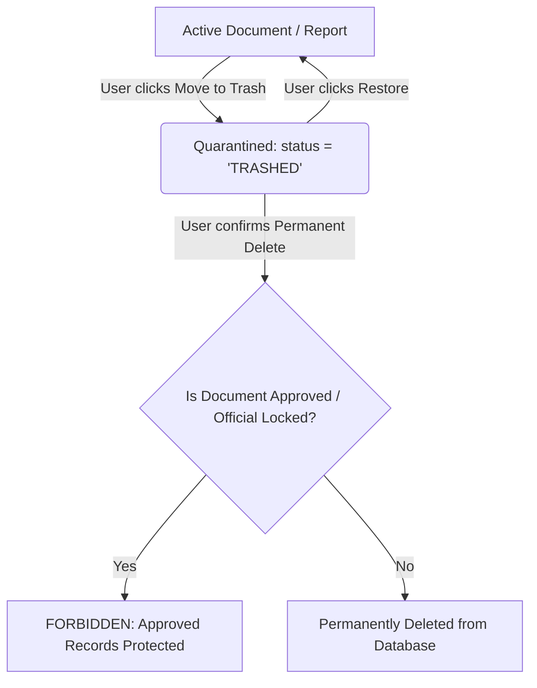

# CampusOS — Workspace Trash & Document Lifecycle Report

**Date**: August 20, 2026  
**Scope**: Campus Office Workspace (`CampusOfficeWorkspace.tsx`), Report Builder (`CampusReportBuilder.tsx`), Campus Drive (`CampusDrivePage.tsx`), Backend Document Service (`workspace.document.service.ts`), and Enterprise Office Controller (`campus-office.controller.ts`).

---

## 1. Document Lifecycle & Quarantine Architecture

To prevent accidental data loss and protect institutional governance, CampusOS employs a multi-tier document deletion lifecycle:

---

## 2. API & Frontend Integration

### 2.1 Backend Endpoints (`/api/workspace/documents` & `/api/campus-office/documents`)
- **Move to Trash**: `DELETE /api/workspace/documents/:id`
  - Sets `status: 'TRASHED'`.
  - Sets associated `CampusDriveItem.isTrashed = true`.
  - Logs audit event `DOCUMENT_TRASHED`.
- **Restore from Trash**: `POST /api/workspace/documents/:id/restore`
  - Reverts `status: 'DRAFT'`.
  - Sets associated `CampusDriveItem.isTrashed = false`.
  - Logs audit event `DOCUMENT_RESTORED`.
- **Permanent Deletion**: `DELETE /api/workspace/documents/:id/permanent`
  - Enforces safety check: document **must** already be in `TRASHED` state.
  - Enforces record protection: documents with status `APPROVED` or `isLocked: true` **cannot** be permanently deleted.
  - Deletes all comments, versions, and document record.
  - Logs audit event `DOCUMENT_PERMANENTLY_DELETED`.

### 2.2 Frontend UI (`CampusOfficeWorkspace.tsx`)
- Added **`Trash` Tab** to the main workspace navigation bar.
- Each active document card displays a hover action to **Move to Trash** with confirmation dialog.
- Inside the Trash Tab:
  - Displays quarantine banner: *"Items in Trash are quarantined. You can restore them to active drafts or permanently remove them."*
  - Dedicated cards with `TRASHED` badge, document type, author, and timestamp.
  - **`Restore` Button** (`RotateCcw`): Restores the document back to active list.
  - **`Delete Permanently` Button** (`Trash2`): Prompts with strict confirmation before permanent purge.

---

## 3. Automated Verification Results

Executed `verify_ui_workspace_avatar.ts`:
- **Document Creation**: Created test document.
- **Soft Delete**: Verified `status === 'TRASHED'` in database.
- **Trash Query**: Verified document appears in `status: 'TRASHED'` query list.
- **Restore**: Verified `status === 'DRAFT'` after restore.
- **Permanent Purge**: Verified complete removal from database after re-trashing.
- **Protection Check**: Verified that deleting an `APPROVED` official record throws `BadRequestException: Approved official documents cannot be deleted. Archive instead.`
