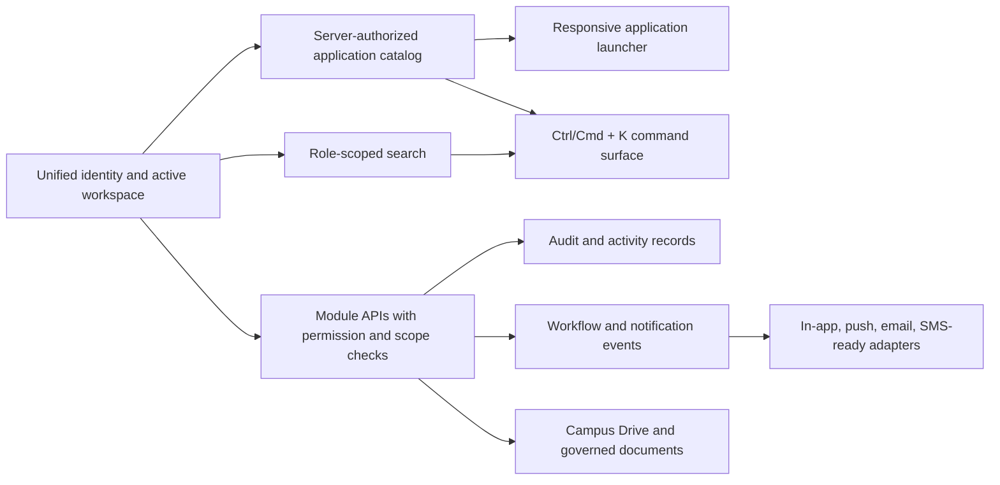

# GEETORUS CAMPUSOS enterprise suite architecture

Date: 2026-08-19

## Architectural direction

CampusOS remains one modular monolith with explicit provider boundaries. The existing Prisma/PostgreSQL, Express, React, Capacitor, active-workspace RBAC, feature-flag, audit, notification, and export foundations remain authoritative. New collaboration capabilities should join those foundations instead of creating separate identity, navigation, permission, or storage silos.

## Shared platform contract

## Application availability rules

1. Authentication resolves the selected active workspace on every request.
2. The application catalog evaluates active role, current permissions, feature flags, and a real client route.
3. The client renders only the returned catalog. It refreshes when the launcher opens, so permission and feature changes do not require logout.
4. Hiding an application is never the security boundary. Each module API independently applies authentication, feature, permission, ownership, department, assignment, or participant checks.
5. Applications without a real route are absent from the catalog. Product planning state is never presented as usable functionality.

## Search privacy contract

| Result type | Server boundary |
| --- | --- |
| People | Existing role hierarchy, own department, assigned mentee, own profile, or own child rules |
| Documents | Owner, explicit user/role share, department scope, or all-campus scope |
| Tasks | Creator, assignee, public visibility, or matching department visibility |
| Calendar | Student-created, public institution, or public matching-department event |
| Messages | Conversation participant membership |
| Applications | Active role, permissions, feature flag, and reachable route |

Search results are navigation summaries. Mutating or detailed APIs must repeat authorization and cannot trust the search result link.

## Required module shape

Every new suite application must ship as one complete vertical slice:

1. Prisma models, indexes, constraints, timestamps and migration.
2. Permission vocabulary and seeded role defaults.
3. Request validation, authentication, feature guard and resource-scope authorization.
4. Service and repository operations with pagination and audit events.
5. Notification and integration events where applicable.
6. Typed client API, responsive UI, loading/empty/error/success states and accessibility.
7. App catalog entry only after the route is usable.
8. Unit, security-boundary, migration, build and role workflow verification.

## Delivery sequence for remaining product programs

| Order | Program | Reason |
| ---: | --- | --- |
| 1 | Campus Drive ACL, binary objects and unified file picker | Mail, Chat, Classroom, Meet, Docs and Sites all depend on trustworthy reusable files |
| 2 | Campus Mail | Adds the largest missing communication system and exercises Drive, contacts, calendar and tasks integrations |
| 3 | Unified Classroom | Consolidates existing assignment, material, attendance, quiz, submission and grade capabilities |
| 4 | Calendar and Meet | Establishes invitations, RSVP, provider adapters, attendance and meeting artifacts |
| 5 | Chat channels and communication policy | Completes role discovery, channels, reactions, mentions and file reuse |
| 6 | Whiteboard and Sites | Builds on mature collaboration, storage, sharing and publishing foundations |
| 7 | AI provider and grounded retrieval layer | Adds audited, permission-filtered assistance across stable content systems |
| 8 | Search index, durable event/outbox and background workers | Scales cross-application operations for large institutions |

