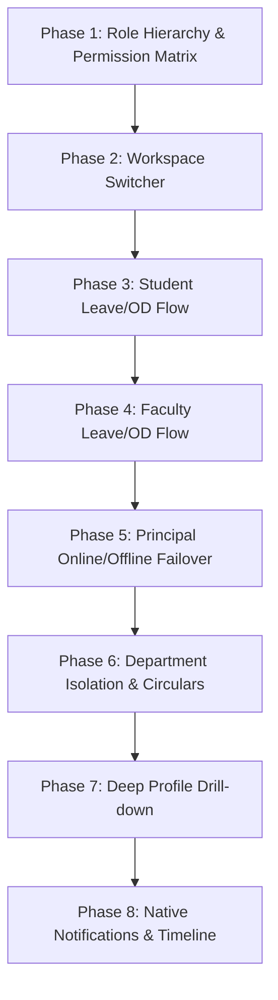

# AEC CampusOS - Master Architecture & Implementation Blueprint

## Executive Overview & System Architecture
AEC CampusOS is an Enterprise Multi-Tenant Higher Education Resource Planning (ERP) Platform.
The ecosystem comprises:
- **Core Database**: PostgreSQL (Prisma ORM)
- **Enterprise Backend Service**: Node.js / Express / TypeScript REST API + Socket.IO Real-Time Engine
- **Web ERP Portal**: React / Vite / TypeScript Web Application
- **Enterprise Mobile Application**: Expo / React Native / TypeScript Mobile Application

Both the Web ERP and Mobile Client interact with a unified backend, single database, shared RBAC permissions, and real-time Socket.IO event buses.

---

## Architectural Breakdown by Phase

### Phase 1 → Role Hierarchy & Permission Matrix
- **Roles**:
  - `STUDENT`, `FACULTY`, `MENTOR`, `HOD`, `DEAN_ACADEMIC`, `DEAN_ADMISSIONS`, `DEAN_IQAC`, `DEAN_SH`, `COE`, `VICE_PRINCIPAL`, `PRINCIPAL`, `PLACEMENT_OFFICER`, `ACCOUNTS_OFFICER`, `LIBRARIAN`, `HOSTEL_WARDEN`, `TRANSPORT_MANAGER`, `SPORTS_DIRECTOR`, `PARENT`, `SUPER_ADMIN`.
- **RBAC Matrix**: Dynamic table mapping Role <-> Module <-> Actions (`CREATE`, `READ`, `UPDATE`, `DELETE`, `APPROVE`, `EXPORT`).
- **DB Schema Integration**: `Role`, `Permission`, `UserRole`, `RolePermission` models stored with granular cached permission keys.

### Phase 2 → Workspace Switcher (Faculty/HOD/Deans)
- **Multi-Role Capability**: Users holding compound positions (e.g., Faculty + HOD or HOD + Acting Principal) can dynamically swap context without re-authenticating.
- **Active Workspace Tokening**: JWT carrying `activeRoleId` and `activeDepartmentId`.
- **Client Workspace Provider**: Synchronizes Drawer, Tabs, Dashboard Widgets, API Scope, and Socket Channels instantly upon workspace swap.

### Phase 3 → Student Leave/OD Flow (Student → Mentor → HOD)
- **Multistage Approval Engine**:
  1. Student submits Leave/OD request with dates, reason, attachments.
  2. Level 1: Assigned Mentor reviews and accepts/rejects.
  3. Level 2: Department HOD reviews and issues final approval.
- **Automated Attendance Adjustment**: Approved OD/Leave automatically updates attendance records to `ON_DUTY` or `EXCUSED_LEAVE`.
- **Socket Notifications**: Push alerts dispatched to Mentor on submission, HOD on Level 1 approval, Student on decision.

### Phase 4 → Faculty Leave/OD Flow (Faculty → HOD → Principal/Acting Principal)
- **Multistage Faculty Approval Engine**:
  1. Faculty submits Leave/OD request.
  2. Level 1: HOD reviews and verifies substitute class allocations.
  3. Level 2: Principal (or Acting Principal) grants final sign-off.
- **Substitution Engine**: Faculty specifies covering faculty for scheduled lectures during leave period.

### Phase 5 → Principal Online/Offline Failover (VP as Acting Principal)
- **Failover / Delegation Engine**:
  - Automatically triggers when Principal status is marked `OFFLINE` / `ON_LEAVE` / `DELEGATED`.
  - Vice Principal (VP) is assigned `ACTING_PRINCIPAL` status with full sign-off authority for Level 2 faculty leaves, institute circulars, and institutional approvals.
  - Full audit trail maintained logging delegated actions taken on behalf of the Principal.

### Phase 6 → Department Isolation & Circulars
- **Data Scoping & Isolation**: Strict multi-tenant department filtering (`departmentId` level checks) ensuring HODs/Faculty access data only within assigned departments.
- **Institutional & Departmental Circular Engine**:
  - Broadcast levels: `ALL_CAMPUS`, `FACULTY_ONLY`, `STUDENT_ONLY`, `DEPARTMENT_SPECIFIC`.
  - Real-time Socket dispatches and push notifications on publish.

### Phase 7 → Deep Profile Drill-down
- **Complete 360° Profile Inspector**:
  - Student Profile: Academic performance, SGPA/CGPA history, attendance logs, leave history, fee breakdown, hostel/transport status.
  - Faculty Profile: Assigned courses, research papers, workload timetable, leave history, student mentorship allocation list.
  - Enterprise Search & Filtering across all modules.

### Phase 8 → Native Notifications & Timeline
- **Notification Engine**:
  - Real-time Socket.IO events + FCM/APNs Native Push Notifications.
  - Deep-link target routes (e.g. `campusos://leave/details/:id`).
- **Interactive Timeline**:
  - Actionable feed recording approvals, circular releases, mark uploads, and system events.

---

## Sequential Implementation Roadmap

### Execution Steps:
1. **Phase 1 Execution**: Define core RBAC schema, seed role matrix, implement authorization middleware.
2. **Phase 2 Execution**: Build Workspace context switcher, API endpoints `/api/v1/auth/switch-workspace`, and client workspace state handlers.
3. **Phase 3 Execution**: Implement Student Leave/OD workflow engine (Prisma models, controller endpoints, validation, Socket events).
4. **Phase 4 Execution**: Implement Faculty Leave/OD workflow with class substitution validation & multi-tier approval.
5. **Phase 5 Execution**: Implement Principal Failover & VP Delegation Service with automated trigger & audit logging.
6. **Phase 6 Execution**: Enforce strict department data scoping middleware + create Circular Management System.
7. **Phase 7 Execution**: Build comprehensive 360° profile aggregation APIs and deep drill-down UI components.
8. **Phase 8 Execution**: Finalize native notification triggers, timeline audit event generator, and Socket.IO real-time dispatchers.
