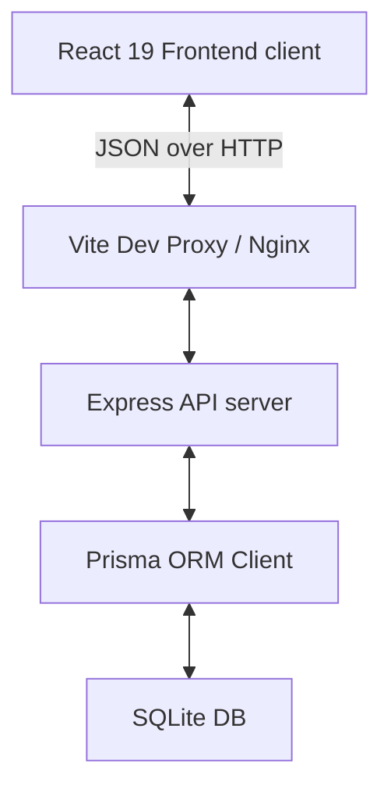

# GEETORUS CAMPUSOS - Enterprise Architecture Documentation

This document explains the technical architecture, patterns, security strategies, and design decisions of the **GEETORUS CAMPUSOS** system.

---

## High-Level Layout

GEETORUS CAMPUSOS employs a decoupled client-server architecture:

- **Frontend Client**: Client-side single page app (SPA) built using React 19 and Vite. State is managed locally via React Context and cached endpoints are managed using TanStack Query.
- **Backend API**: A modular Express application written in TypeScript. It provides a RESTful interface, sanitizes payload shapes with Zod schemas, logs transactions using Winston, and executes database calls via Prisma.

---

## SOLID Principles in Practice

1. **Single Responsibility Principle (SRP)**
   - Components are divided into isolated units: controller actions handle network queries, middlewares enforce validations or checks, and hooks encapsulate local state.
   - Example: `auth.middleware.ts` is only responsible for parsing JWT headers and decoding roles, and does not touch data generation.

2. **Open/Closed Principle (OCP)**
   - Layout primitives like `Button` and `Modal` are open to style extensions using the `className` utility, but closed to modification of their core logic.

3. **Liskov Substitution Principle (LSP)**
   - Custom exceptions (e.g. `BadRequestException`, `UnauthorizedException`) extend the base `HttpException` class and can be parsed interchangeably by the `errorHandler` middleware.

4. **Interface Segregation Principle (ISP)**
   - UI elements are defined with precise TypeScript interfaces (e.g. `ButtonProps`, `SelectOption`) to prevent developers from having to supply properties unrelated to their specific component usage.

5. **Dependency Inversion Principle (DIP)**
   - The React app references mock-agnostic HTTP instances (`lib/axios.ts`) and caches backend responses via abstractions (`@tanstack/react-query`) rather than direct endpoint queries.

---

## Multi-Tenancy Strategy

Multi-tenancy is implemented at the schema level using a shared-database approach:
- Each institution is registered under a `Tenant` model with a unique web `domain`.
- The `User` and `Role` records are mapped to a specific `tenantId`.
- API controllers query datasets scoped to `req.user.tenantId` to ensure secure cross-tenant isolation.
- Future upgrades can safely split tenants into separate physical database pools by swapping Prisma connection strings dynamically inside custom middleware.

---

## RBAC Security & JWT Flow

1. **Authentication**: Users submit credentials at `/api/auth/login`. The server verifies details, logs the `Session` event, and signs a JWT containing the user payload.
2. **Access Control**: The JWT contains a list of permissions (e.g., `users:read`, `settings:write`).
3. **Guard Checking**:
   - **Backend**: Express routes are guarded using `requireAuth` and `requirePermission("users:read")` middlewares.
   - **Frontend**: The `ProtectedRoute` wrapper checks permissions. Inactive links are hidden from view dynamically by reading permissions inside the `Sidebar` element.

---

## Database Migration Strategy (SQLite to PostgreSQL)

To facilitate smooth transitions to PostgreSQL, the database layer is configured with:
- **String UUIDs**: All models use string-based UUID identifiers (`@default(uuid())`) rather than integer autoincrements. This prevents primary key collisions during multi-college database consolidation.
- **Prisma Schema Abstraction**: Database relations rely on Prisma relational types rather than SQLite-specific triggers, making the schema compatible with PostgreSQL without modification.
