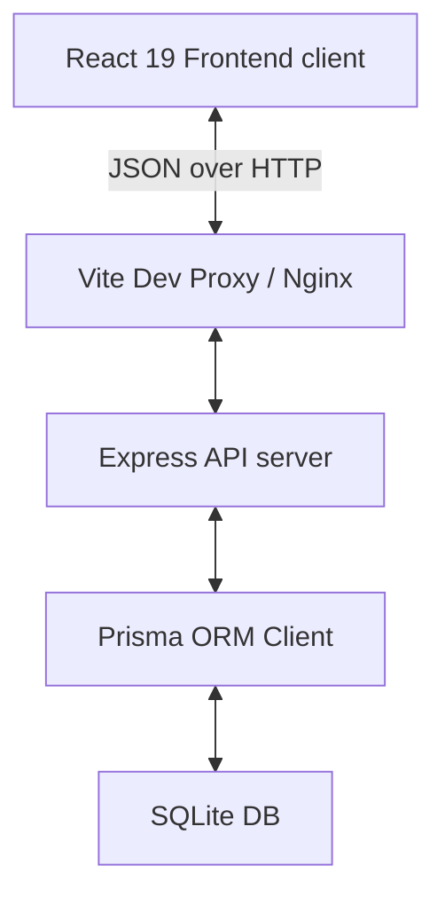
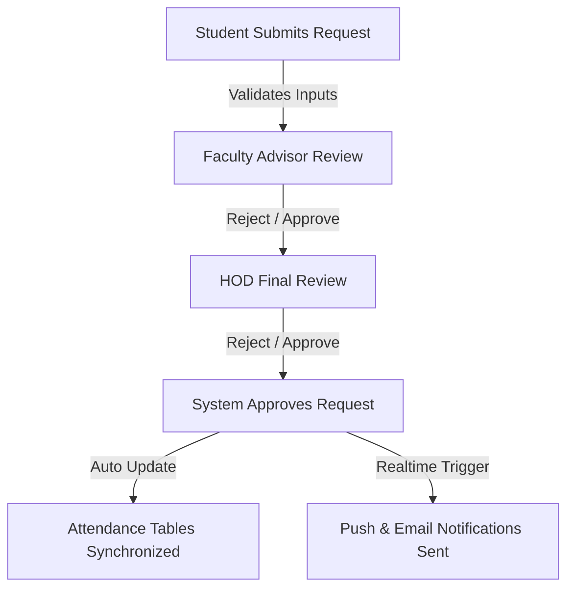
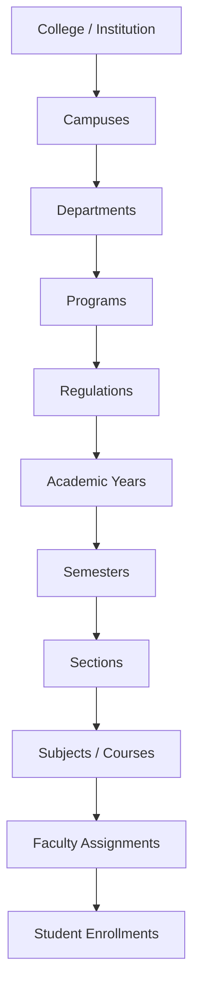

# GEETORUS CAMPUSOS - Enterprise Architecture Documentation

This document explains the technical architecture, patterns, security strategies, and design decisions of the **GEETORUS CAMPUSOS** system.

---

## High-Level Layout

GEETORUS CAMPUSOS employs a decoupled client-server architecture:



- **Frontend Client**: Client-side single page app (SPA) built using React 19 and Vite. State is managed locally via React Context and cached endpoints are managed using TanStack Query.
- **Backend API**: A modular Express application written in TypeScript. It provides a RESTful interface, sanitizes payload shapes with Zod schemas, logs transactions using Winston, and executes database calls via Prisma.

---

## SOLID Principles in Practice

1. **Single Responsibility Principle (SRP)**
   - Components are divided into isolated units: controller actions handle network queries, middlewares enforce validations or checks, and hooks encapsulate local state.
   - Example: `auth.middleware.ts` is only responsible for parsing JWT headers and decoding roles, and does not touch data generation.

2. **Open/Closed Principle (OCP)**
   - Layout primitives like `Button` and `Modal` are open to style extensions using the `className` utility, but closed to modification of their core logic.

3. **Liskov Substitution Principle (LSP)**
   - Custom exceptions (e.g. `BadRequestException`, `UnauthorizedException`) extend the base `HttpException` class and can be parsed interchangeably by the `errorHandler` middleware.

4. **Interface Segregation Principle (ISP)**
   - UI elements are defined with precise TypeScript interfaces (e.g. `ButtonProps`, `SelectOption`) to prevent developers from having to supply properties unrelated to their specific component usage.

5. **Dependency Inversion Principle (DIP)**
   - The React app references mock-agnostic HTTP instances (`lib/axios.ts`) and caches backend responses via abstractions (`@tanstack/react-query`) rather than direct endpoint queries.

---

## Multi-Tenancy Strategy

Multi-tenancy is implemented at the schema level using a shared-database approach:
- Each institution is registered under a `Tenant` model with a unique web `domain`.
- The `User` and `Role` records are mapped to a specific `tenantId`.
- API controllers query datasets scoped to `req.user.tenantId` to ensure secure cross-tenant isolation.
- Future upgrades can safely split tenants into separate physical database pools by swapping Prisma connection strings dynamically inside custom middleware.

---

## RBAC Security & JWT Flow

1. **Authentication**: Users submit credentials at `/api/auth/login`. The server verifies details, logs the `Session` event, and signs a JWT containing the user payload.
2. **Access Control**: The JWT contains a list of permissions (e.g., `users:read`, `settings:write`).
3. **Guard Checking**:
   - **Backend**: Express routes are guarded using `requireAuth` and `requirePermission("users:read")` middlewares.
   - **Frontend**: The `ProtectedRoute` wrapper checks permissions. Inactive links are hidden from view dynamically by reading permissions inside the `Sidebar` element.

---

## Database Migration Strategy (SQLite to PostgreSQL)

To facilitate smooth transitions to PostgreSQL, the database layer is configured with:
- **String UUIDs**: All models use string-based UUID identifiers (`@default(uuid())`) rather than integer autoincrements. This prevents primary key collisions during multi-college database consolidation.
- **Prisma Schema Abstraction**: Database relations rely on Prisma relational types rather than SQLite-specific triggers, making the schema compatible with PostgreSQL without modification.

---

## 5. Student Dashboard

### Purpose
The Student Dashboard acts as the primary hub and command center for student users in the GEETORUS CAMPUSOS College ERP. It provides aggregated views of academic performance, attendance logs, administrative obligations, calendar schedules, and communication channels.

### Business Rules
1. **Scope and Authorization**: Only users authenticated with the `Student` role and mapped to a valid tenant institution may access the dashboard.
2. **Context Binding**: All widgets must automatically filter data using the logged-in student's identifiers (`studentId`, `tenantId`, and current active semester).
3. **Staleness Boundary**: Critical real-time widgets (like upcoming class check-ins or safety notifications) must bypass standard caches and query active tables.

### Workflow
1. User authenticates and visits `/student/dashboard`.
2. Router verifies session token, resolves role, and invokes the API endpoint `/api/enterprise/students/dashboard-summary`.
3. Server queries DB for student metrics: attendance summaries, GPA statistics, course registrations, library status, notifications, and calendar logs.
4. Response payload is returned as JSON.
5. Client-side dashboard component populates interactive cards, feeds, and analytics graphs.

### Functional Requirements
- **Welcome Banner**: Displays the student's photo, complete name, roll number, register number, department, academic department, current year, current semester, section, assigned mentor name, and Head of Department (HOD) name.
- **Quick Statistics Widgets**: Renders high-level counts: Overall Attendance %, CGPA, Completed Credits, Remaining Credits, Pending Homework tasks, Pending Assignment submissions, Upcoming Exam dates, Library Overdue books, Leave Status details, OD Status details, Placement Eligibility indicator, and Internship Application status.
- **Recent Feeds & Calendars**: Real-time tray listing academic circulars, calendar milestones, general activities, and upcoming events.
- **Quick Action Actions**: Trigger buttons to: Apply for Leave, Apply for On-Duty (OD) permit, Download Digital ID Card PDF, View results page, Open current timetable, and invoke the AI Academic Assistant modal.
- **Dashboard Analytics Layout**: Visual graphical gauges indicating:
  - Attendance Trend over time (line chart).
  - CGPA Trend across completed semesters (bar/line chart).
  - Semester Progress representation (progress bar).
  - Credit Completion percentage (radial dial).

### User Permissions
- `student:read` - Read-only access to dashboard data.
- `student:write` - Action triggers (leave/OD forms submission).

### Database Dependencies
- `Student`, `Department`, `AcademicDepartment`, `User`, `Attendance`, `Grade`, `Homework`, `Assignment`, `Exam`, `LibraryBook`, `Leave`, `OD`, `Placement`, `Notification`, `Circular`, `Mentor`.

### UI Components
- **WelcomeBannerCard**: Glassmorphic header card with profile image placeholder, info grids.
- **QuickStatsGrid**: Responsive flex-grid containing micro-cards for status tags.
- **ActionCenterPanel**: Flex button toolbar for quick shortcuts.
- **AnalyticsDashboardSection**: Visual component containing dynamic charts (AttendanceTrend, CgpaTrend, ProgressTrackers).

### Validation Rules
- Attendance values must stay bounded between `0.00%` and `100.00%`.
- CGPA ranges must lie strictly between `0.00` and `10.00`.
- All credit counters must be positive integers.

### Security Considerations
- Data retrieval query must enforce tenancy parameters (`tenantId`) and owner checks (`studentId === req.user.id`).
- Inputs to filters (like semester dropdowns) must be validated using Zod.

### Future Scalability
- Cache static student configurations (such as Department details, Roll Number) in Redis with a 24-hour TTL to save database query budget.

---

## 6. Student Profile

### Purpose
Provides a comprehensive record of a student's personal, academic, contact, and security parameters, acting as the Single Source of Truth (SSOT) for student demographics within the institution.

### Business Rules
1. **Self-Service Restrictions**: Students can directly modify personal communication, emergency contact, and profile photos. Academic details (Program, Regulation, Batch, Year, Semester, Section) can only be altered by authorized registrars or administrative staff.
2. **Identity Proofs**: Government identifiers (Aadhaar, Passport, PAN) are read-only once verified by the academic section.
3. **Verification State**: Profile completion indicators must update dynamically relative to required fields completed.

### Workflow
1. Student accesses profile page.
2. Server loads record from the `Student` schema.
3. Student completes or updates fields (e.g., updates permanent address or uploads profile photo).
4. System validates inputs against strict regex filters.
5. Server persists updates, creates audit logs, and returns the updated profile.

### Functional Requirements
- **Personal Information**: Complete name, blood group, nationality, community status, religion, parent details, guardian details, and emergency contacts.
- **Academic Information**: Permanent branch, academic department, program code, curriculum regulation, batch year, academic year, semester, section, and student category (e.g., Day Scholar, Hosteller).
- **Communication & Address**: Current address, permanent address, verified email, and phone number.
- **Government IDs**: Aadhaar number field, Passport details, and PAN (optional).
- **Security Dashboard**: Profile completion percentage meter, Photo Upload interface, Password Change console, Email/Phone Verification toggles, Two-Factor Authentication (2FA) configurator, Login History log, and active session device listing.

### User Permissions
- `profile:read` - Access own profile details.
- `profile:update` - Submit changes to allowed fields.
- `profile:security-write` - Modify security settings, 2FA status, and password.

### Database Dependencies
- `Student`, `User`, `LoginHistory`, `AuditTrail`.

### UI Components
- **ProfileHeader**: Displays avatar, status indicators, and overall completion meter.
- **TabbedProfileContainer**: Categorized tabs for Personal, Academic, Addresses, IDs, and Security Settings.
- **UploaderWidget**: Dropzone for profile photo upload with client-side cropping.

### Validation Rules
- Email addresses must conform to RFC 5322 format.
- Mobile numbers must validate against appropriate country dialing codes (e.g., standard 10-digit formats).
- Aadhaar numbers must be 12-digit integers.

### Security Considerations
- Password changes require verification of the existing active password.
- Document/Photo uploads must be scanned and limited in size to prevent denial-of-service vector exploitation.

### Future Scalability
- Store profile images in an S3-compatible object store utilizing pre-signed URLs rather than base64 strings in the relational DB.

---

## 7. Digital Student ID

### Purpose
Generates an online, verifiable representation of the student's institutional identity card, suitable for digital check-ins, security access, and printing.

### Business Rules
1. **Verification Requirement**: A valid, signed QR code and barcode must accompany every generated card to enable offline integrity verification.
2. **Validity Boundary**: The card must automatically display an 'EXPIRED' watermark if the current date surpasses the institutional validity timeline of the student's batch.
3. **No Self-Modifications**: The student cannot alter fields on the ID card.

### Workflow
1. Student triggers "View ID Card" from dashboard or menu.
2. Client sends request to `/api/enterprise/students/digital-id`.
3. Server retrieves profile credentials, checks academic state, and compiles a signed verification payload containing cryptographic hashes.
4. UI displays CR80 portrait layout representation of ID card front and back.
5. Student downloads card as PDF or prints directly.

### Functional Requirements
- **Front Layout (CR80 Standard)**:
  - Official College Logo and Name header.
  - Profile photo.
  - Core student attributes: Name, Register Number, Department, Academic Department, Blood Group, and Card Validity date.
  - Scannable QR Code containing the encrypted verification verification URL.
  - Standard barcode representing the student's register number.
  - Authorized signatures (Student Signature and Principal Signature).
- **Back Layout**:
  - Emergency contact numbers.
  - Current address record.
  - Institution Rules & Regulations snippet.
  - Verification Portal URL.
  - Card issue date and schema version.
- **Actions**: Download PDF button, Print action trigger, QR Verification validation.

### User Permissions
- `digital-id:read` - Render and display the digital ID card representation.
- `digital-id:download` - Trigger PDF export function.

### Database Dependencies
- `Student`, `Tenant`, `Signatures`.

### UI Components
- **DigitalIdCardContainer**: Dual-sided flip card with CSS 3D transitions.
- **QrCodeWidget**: Renders the verification link.
- **BarcodeWidget**: Standard HTML barcode generator.

### Validation Rules
- Cryptographic verification payload must match signature parameters.
- Valid coordinates for Principal signature positioning.

### Security Considerations
- QR Codes must contain signed tokens (JWTs) preventing forgery.
- Verification endpoint `/verify-id/:token` must implement strict rate limiting to prevent enumeration attacks.

### Future Scalability
- Integrate Apple Wallet and Google Wallet passes via standard PKPass compilation.

---

## 8. Career Platform

### Purpose
Facilitates end-to-end career progression including placements, internship opportunities, resume optimization, and skill matrix evaluations.

### Business Rules
1. **Eligibility Enforcement**: Students can apply for placement drives only if they satisfy the company-defined minimum CGPA and maximum backlog policies.
2. **Offer Policy**: System locks further placement applications once a student accepts a marquee/super-dream offer, conforming to college policy.
3. **Internship Approval**: All internship proposals require official faculty supervisor and HOD signatures.

### Workflow
1. Company posts drive -> Admin sets eligibility filters.
2. Eligible students receive notifications and view the listing in Placement Portal.
3. Student uploads resume -> submits application.
4. Placement officer updates status -> Shortlist, Interviews, Offer stage.
5. Student receives offer -> uploads completion credentials if internship.

### Functional Requirements
- **Placement Portal**: Directory of active corporate recruiting drives, company criteria filters, eligibility matching engine, applications timeline, interview schedule track, shortlist rosters, and offer letter uploaders.
- **Internship Portal**: Listing of available internships, faculty approval workflow tracking, company coordinator feedback logs, and internship completion certificate uploaders.
- **Resume & Profile Builder**: Integrated portfolio linkers (GitHub, LinkedIn, LeetCode, HackerRank, GeeksForGeeks profiles), technical skill lists, and custom portfolio layouts.
- **Career Analytics Widgets**: Interactive panel summarizing:
  - Resume score analyzer.
  - Interview readiness assessments.
  - Placement readiness metrics.
  - Skill Gap Analysis.
  - AI-based Salary Prediction.
  - Adaptive Learning Roadmap.

### User Permissions
- `placement:read` - View company details and schedules.
- `placement:apply` - Apply to eligible drives.
- `resume:write` - Update portfolio and resume parameters.

### Database Dependencies
- `PlacementDrive`, `PlacementApplication`, `InternshipOpportunity`, `StudentResume`, `SkillMatrix`, `OfferLetter`.

### UI Components
- **DrivesDirectory**: Searchable grid showing active placement opportunities.
- **ApplicationTracker**: Timeline showing application stages (Applied, Screened, Interviewing, Offered).
- **SkillGapChart**: Radar chart illustrating student skills vs. market demands.

### Validation Rules
- CGPA checking must prevent applications from students below criteria.
- File uploads for Offer Letters/Certificates must restrict to PDF format.

### Security Considerations
- GPA and backlog counters used for eligibility checks must be fetched directly from database tables, preventing client-side spoofing.

### Future Scalability
- Implement asynchronous batch processing for resume parsers to ensure web server stability.

---

## 9. Library Management

### Purpose
Integrates physical library transactions and digital library assets into a consolidated catalog access portal for the student.

### Business Rules
1. **Borrowing Limitations**: Maximum of 5 books can be checked out concurrently per student.
2. **Renewal Rule**: Renewal is prohibited if another user has placed a reservation on the issued book.
3. **Fine Policies**: Automated fine accumulation of $1/day for overdue books.

### Workflow
1. Student searches catalog via keyterms.
2. Student reserves book online -> Admin issues book -> Checkout recorded.
3. Student monitors due dates -> executes renewals if eligible.
4. For digital library: Searches e-books, scans barcodes, or views digital research papers.

### Functional Requirements
- **My Books Shelf**: Detailed view of currently issued books, due dates, renewal counter, and overdue indicators.
- **Reservations Queue**: Lists reserved books and reservation queue position.
- **Fine Management Panel**: Outstanding fines, fine breakdown details, and transaction history.
- **Digital Library Catalog**: Full-text searching of E-Books, institutional research papers, and previous semester question papers.
- **Scanning Tools**: Integrated QR/Barcode scanning feature for quick book details retrieval.

### User Permissions
- `library:read` - Search catalog, view issued items, and outstanding fines.
- `library:write` - Place book reservations, request renewals.

### Database Dependencies
- `LibraryBook`, `BookTransaction`, `BookReservation`, `FineLog`, `DigitalAsset`.

### UI Components
- **IssuedBooksGrid**: Grid view of borrowed book covers, return timelines, and quick action controls.
- **SearchCatalogConsole**: Multi-filter catalog search input with auto-suggestions.
- **BarcodeScannerModal**: Camera-based reader component.

### Validation Rules
- Renewal requests are denied if current date is 3+ days past the due date.
- Book reservations capped at 3 concurrent items.

### Security Considerations
- Digital document downloads (e.g. question papers) must be monitored via rate limiters to prevent catalog scraping.

### Future Scalability
- Real-time catalog updates via WebSockets for book availability states.

---

## 10. Hostel Management

### Purpose
Manages student residential accommodation, room allocation, mess choices, complaints, visitor logs, and gate pass requests.

### Business Rules
1. **Leave Permits**: Weekend gate passes require parental consent verified via email/SMS notifications.
2. **Attendance Policy**: Automated night check-ins recorded via biometric logs must link directly to the hostel portal.
3. **Fee Dues**: Room allocation is withheld if mess or room fee dues exceed configured thresholds.

### Workflow
1. Student applies for room allocation or hostel change.
2. System displays room details and roommates.
3. Student registers complaints, tracks mess menu, updates visitor logs, or requests leave passes.
4. HOD/Warden reviews gate pass requests -> Approves -> Attendance update.

### Functional Requirements
- **My Room Profile**: Room number, block identifier, roommate directory, and checklist of provided inventory.
- **Mess Panel**: Weekly menu schedule, meal ratings, and dietary preferences selector.
- **Complaints Board**: Ticket system for maintenance requests, with photo attachment capability.
- **Visitor Logs**: Register details of planned visitors for security clearance.
- **Outing & Leave System**: Apply for gate pass, track approval progress, and monitor history.
- **Financial Details**: Hostel fee breakdowns, due alerts, and transaction receipts.

### User Permissions
- `hostel:read` - View room info, mess menus, and fee records.
- `hostel:write` - Lodge complaints, request gate passes, and log visitors.

### Database Dependencies
- `HostelBlock`, `HostelRoom`, `MessMenu`, `HostelComplaint`, `HostelLeave`, `HostelFee`, `VisitorLog`.

### UI Components
- **RoommatesCard**: Profile card deck showing roommate cards.
- **WeeklyMessPlanner**: Dynamic calendar view showing meal plans.
- **TicketHistoryTable**: Status tracking grid for maintenance tickets.

### Validation Rules
- Outing durations cannot exceed 72 hours without warden verification.
- Complaint descriptions must have a minimum length of 10 characters.

### Security Considerations
- Visitor details must be purged periodically or anonymized after graduation to adhere to privacy regulations.

### Future Scalability
- Integrate IoT devices for smart room inventory tracking and energy management logs.

---

## 11. Transport Management

### Purpose
Administers student transport allocation, bus routes navigation, driver communication, GPS coordinates monitoring, and fee status checks.

### Business Rules
1. **Seat Allocation**: Students can only register for one primary route and pickup point at any given time.
2. **Attendance Integration**: Boarding/deboarding events parsed from RFID tags update the student transport attendance ledger in real time.
3. **Route Changes**: Route alteration requests are blocked during active semesters unless authorized by the transport dean.

### Workflow
1. Student checks available routes and registers for transport.
2. Transport manager allocates bus and seat.
3. Student monitors real-time bus location via GPS tracking.
4. Student updates feedback or files complaints if needed.

### Functional Requirements
- **My Bus Overview**: Assigned bus number, registration details, driver contact numbers, and pickup spot specifications.
- **Bus Routes Catalog**: Full details of institutional route stops and timings.
- **GPS Tracking Integration**: Interactive map showing current bus coordinate points and Estimated Time of Arrival (ETA).
- **Transport Logs**: Boarding history calendar and attendance logs.
- **Administrative Panel**: Route change forms, complaint registrations, emergency contact quick-dials, and transport fee schedules.

### User Permissions
- `transport:read` - View routes, driver details, and maps.
- `transport:write` - Request route alterations, report service issues.

### Database Dependencies
- `BusRoute`, `BusVehicle`, `BusDriver`, `PickupPoint`, `TransportRegistration`, `TransportAttendance`, `TransportComplaint`.

### UI Components
- **GpsTrackingMap**: Leaflet/Google Maps wrapper displaying active coordinates.
- **RouteTimeline**: Vertical timeline mapping stops and scheduled arrival times.

### Validation Rules
- Route change requests must contain a valid justification.
- Arrival times must format to 24-hour cycles.

### Security Considerations
- GPS coordinate feeds must be accessible only via authenticated sessions to prevent tracking by unauthorized actors.

### Future Scalability
- Serverless microservice processing for high-frequency GPS coordinate broadcasts from tracking devices.

---

## 12. AI Academic Assistant

### Purpose
Employs machine learning and LLM integrations to provide students with custom recommendations, performance predictions, study schedules, and career roadmaps.

### Business Rules
1. **Data Isolation**: The AI engine cannot access user data of other students; query boundaries are restricted to the requesting student.
2. **Disclaimer Notice**: All predictions and recommendations are marked as advisory; administrative grading remains the official record.
3. **Rate Limits**: Monthly quota limits enforced per user to prevent API cost overruns.

### Workflow
1. Student sends natural language query or requests performance prediction.
2. Server loads student data (grades, attendance, skills) and passes anonymized context to LLM/ML pipelines.
3. AI engine compiles response, saves chat history, and returns recommendations.

### Functional Requirements
- **Natural Language Chat Console**: Persistent chat workspace with full conversation history and markdown rendering.
- **Performance Predictors**: Predictive algorithms calculating:
  - CGPA forecast based on current course loads.
  - Attendance projection models warning of potential deficits.
  - Weak subject detection by analyzing internal exam histories.
- **Career & Study Planners**:
  - Customized study timetables.
  - Smart quiz generator based on weak course areas.
  - Resume parser and optimizer suggestions.
  - Job placement readiness assessment and salary estimations.
  - Dynamic skill acquisition roadmaps.

### User Permissions
- `ai:chat` - Interact with conversational assistant.
- `ai:predict` - Trigger performance forecasting pipelines.

### Database Dependencies
- `AiChatHistory`, `Student`, `Grade`, `Attendance`, `CourseSyllabus`, `SkillMatrix`.

### UI Components
- **ChatWindow**: Scroll-locked messaging feed with code highlighting and markdown support.
- **PredictionDashboard**: Gauges displaying GPA projections and alert thresholds.

### Validation Rules
- Chat message payloads restricted to a maximum of 4000 characters.
- Query rate limited to 30 requests/hour/user.

### Security Considerations
- Prompt injection protection layers must check all message inputs.
- Anonymize personally identifiable information (PII) before routing to external LLM providers.

### Future Scalability
- Asynchronous queuing model using RabbitMQ/Redis for heavy inference tasks.

---

## 13. Leave & OD Workflow

### Purpose
Standardizes the application, routing, evaluation, and logging of student Leave and On-Duty (OD) permissions.

### Business Rules
1. **Chain of Command**: Student -> Assigned Faculty Advisor -> Head of Department (HOD) -> Administrative Dean.
2. **Auto-Rejection**: Leave requests with overlapping dates are blocked from submission.
3. **Attendance Lock**: Approved Leave/OD status automatically updates affected attendance rosters post HOD confirmation.

### Workflow


### Functional Requirements
- **Submission Console**: Date range picker, leave type selector (Casual, Medical, OD), upload field for supporting proofs, and remarks input.
- **Status Dashboard**: Visual progress timeline showing approval checkpoints (Advisor, HOD status).
- **History Portal**: Historical logs of requests, advisor remarks, rejection reasons, and detailed audit trails.

### User Permissions
- `leave:create` - Submit requests.
- `leave:read` - Track request histories.

### Database Dependencies
- `LeaveRequest`, `OdRequest`, `FacultyAdvisor`, `Hod`, `Attendance`, `AuditTrail`.

### UI Components
- **LeaveForm**: Multistep form with attachment dropzones.
- **ApprovalTimeline**: Step-by-step progress tracking indicator.

### Validation Rules
- Medical leaves exceeding 3 days must mandate a PDF medical certificate upload.
- Backdated applications must require justification remarks.

### Security Considerations
- Uploaded files must undergo virus scans and be stored in private, non-public directories.
- Status changes require server-side validation of the acting user's role.

### Future Scalability
- Offload notification alerts to queue systems to prevent transaction delays during high load.

---

## 14. Notification Engine

### Purpose
Delivers real-time and scheduled notifications to students regarding academics, administrative actions, and urgent alerts.

### Business Rules
1. **Opt-in Boundaries**: Students cannot opt-out of emergency alerts, financial warnings, or exam alerts.
2. **Channel Failover**: Critical alerts failover from Push -> Email -> SMS if not read within 10 minutes.
3. **Archival Boundary**: Notifications older than 90 days are archived automatically to database partition tables.

### Workflow
1. Action occurs (e.g., Assignment posted).
2. Notification engine formats payload relative to channel.
3. System pushes live updates via WebSockets and sends Email/SMS notifications via external gateways.
4. Student views alert in UI notification tray, marking read states.

### Functional Requirements
- **Multi-Category Filter**: Sort notifications by categories (Academic, Attendance, Fees, Library, Hostel, Transport, Placements, Assignments, Homework, Circulars, Emergency Alerts).
- **Live Sync Tray**: Dynamic notification header icon with unread count indicator.
- **Preferences Center**: User configuration dashboard for opt-in channel settings.
- **Actions**: Mark all as read, archive messages, and clear logs.

### User Permissions
- `notification:read` - Fetch alerts feed.
- `notification:write` - Update read and preference settings.

### Database Dependencies
- `Notification`, `NotificationPreference`, `User`.

### UI Components
- **NotificationDrawer**: Collapsible sidebar with category indicators.
- **PreferencesGrid**: Checklist grid mapping categories to channels (Push, Email, SMS).

### Validation Rules
- Category tags must match system enumerations.
- Custom notification templates must pass safety checks to prevent XSS payloads.

### Security Considerations
- WebSocket connections must validate JWT handshake parameters.
- Alert data must not expose PII in general notification logs.

### Future Scalability
- Use Redis Pub/Sub model for horizontally scaled socket connections.

---

## 15. Academic Calendar

### Purpose
Serves as the chronological reference point for all curricular, co-curricular, and extracurricular schedules throughout the active academic cycle.

### Business Rules
1. **Dean Governance**: Only the Academic Dean or Admin can publish general calendar milestones.
2. **Targeted Delivery**: Calendar feeds must filter target groups automatically (e.g., department-specific seminars or holidays).
3. **Personalization Rules**: Student personal schedules (holidays, approved leaves) merge dynamically with institutional events.

### Workflow
1. Event is published by Administrator.
2. System updates database calendars.
3. Student loads calendar view.
4. Frontend aggregates general college events, department-specific workshops, individual assignments, and leaves.
5. User filters views by month, week, or day.

### Functional Requirements
- **Dynamic Scheduler Layout**: Full monthly, weekly, and daily grid schedules.
- **Category Indicators**: Color-coded categorization tags for:
  - Examinations (Internal, Semester).
  - Assignments and Homework deadlines.
  - Placement drives.
  - Hackathons, workshops, and seminars.
  - Institutional holidays and closures.
  - Department events.
  - Birthdays and leave schedules.
- **Event Detail Popups**: Clickable events displaying times, venues, speakers, and attachments.

### User Permissions
- `calendar:read` - View calendar items.
- `calendar:write-personal` - Log custom personal notes.

### Database Dependencies
- `AcademicCalendarEvent`, `DepartmentEvent`, `ExamSchedule`, `Assignment`, `LeaveRequest`.

### UI Components
- **CalendarGrid**: Interactive monthly grid component.
- **EventDetailModal**: Sidebar modal showing venue maps, descriptions, and materials.

### Validation Rules
- Event end dates must follow start dates.
- Event descriptions must have a maximum length of 1000 characters.

### Security Considerations
- Sanitize description fields to prevent storage XSS.
- Rate limit calendar export endpoints (iCal/ICS download).

### Future Scalability
- Implement caching layer for general institutional events.

---

## 16. Security

### Purpose
Defines the enterprise-grade security structures, authentication safeguards, access isolation, and data protection designs.

### Business Rules
1. **Token Lifetime**: JWT Access tokens valid for 15 minutes; Refresh tokens valid for 7 days.
2. **Departmental Isolation**: Cross-department data reads are blocked unless authorized by roles with global permissions.
3. **Session Purging**: Inactive sessions terminated after 20 minutes of inactivity.

### Security Strategy Matrix
```
+-------------------------------------------------------------+
|                     GEETORUS CAMPUSOS SECURITY               |
+-------------------------------------------------------------+
| Authentication  | JWT Access Token, HttpOnly Cookie Refresh |
| Access Control  | RBAC Guarding, Permission verification     |
| Isolation       | Tenant isolation, Department queries filter|
| Data Protection | AES-256 File crypt, Bcrypt password hashes|
| Edge Guards     | Rate limiting, WAF rules, CORS filters    |
+-------------------------------------------------------------+
```

### Functional Requirements
- **JWT & RBAC Architecture**: Implements secure authorization via JWT header payloads containing permission matrices.
- **Department & Tenant Isolation**: Implements isolation policies scoping database reads strictly using request-bound tenant parameters.
- **Active Session Audit Panel**: Display IP address locations, active device types, login timelines, and token invalidation options.
- **Edge Guards**: Rate limiters block brute force attempts, and validation layers sanitize inputs against SQL injection, CSRF, and XSS patterns.

### User Permissions
- `security:read-sessions` - View login history.
- `security:revoke-session` - Invalidate active session tokens.

### Database Dependencies
- `User`, `ActiveSession`, `SecurityAuditLog`.

### UI Components
- **LoginHistoryTable**: List of recent login attempts with geolocation and IP identifiers.
- **TwoFactorSetupModal**: Renders QR codes for Authenticator apps (TOTP).

### Validation Rules
- Passwords must enforce complexity standards: min 12 characters, uppercase, lowercase, numbers, and symbols.
- TOTP token inputs must be 6-digit integers.

### Security Considerations
- Refresh tokens must be stored in secure, HttpOnly, SameSite cookies.
- File uploads require content verification (magic numbers) to prevent execution vectors.

### Future Scalability
- Integrate OAuth2/OIDC standards for seamless single-sign-on (SSO) federation.

---

## 17. File Management

### Purpose
Manages student file uploads, attachments, academic submissions, verification checks, and storage quotas.

### Business Rules
1. **Size Thresholds**: Maximum upload limits: Assignments/Homework (10MB), Profiles/Signatures (2MB), Medical/Leave documents (5MB).
2. **Type Restrictions**: Restrict uploads strictly to approved MIME formats (e.g. PDF, JPG, PNG, DOCX, ZIP).
3. **Compliance Policy**: All uploads must pass verification checks before storage write commands are committed.

### Workflow
1. Student selects file -> Client checks size and extension.
2. File is sent to upload route.
3. Middleware checks file signature, runs virus scans, and renames file using a random UUID.
4. File is written to storage, transaction is logged, and URL is returned.

### Functional Requirements
- **Upload Center**: File dropzones with status bars and validation indicators.
- **Storage Profile Tracker**: Real-time display of student storage quota consumption.
- **Log Monitor**: File download tracking records.
- **Asset Categories**: System handles:
  - Assignments and homework templates.
  - Leave justifications and medical certificates.
  - Resumes, profile photos, and portfolio files.

### User Permissions
- `file:upload` - Upload documents.
- `file:delete` - Remove own uploaded files.

### Database Dependencies
- `FileStorageMetadata`, `DownloadLog`, `Student`.

### UI Components
- **DropzoneWidget**: Drag-and-drop file interface with cancel and retry options.
- **StorageProgressBar**: Visual indicators showing bytes used vs. allowed thresholds.

### Validation Rules
- Block execution extensions (e.g. `.exe`, `.bat`, `.js`, `.sh`).
- Block double extensions (e.g. `document.pdf.exe`).

### Security Considerations
- Store assets on isolated document servers away from application execution roots.
- Pre-sign links to secure resources with short expiration periods (e.g., 5-minute TTL).

### Future Scalability
- Integrate Content Delivery Network (CDN) edges for general public media distribution.

---

## 18. Student Analytics

### Purpose
Aggregates and visualizes performance and behavior metrics to help students monitor their academic path and career readiness.

### Business Rules
1. **Context Boundary**: Trend analytics can only query the requesting student's records.
2. **Term Isolation**: Semester-specific performance metrics must segment by distinct academic terms.
3. **Indicator Updates**: Predictive indicators (e.g., placement readiness scores) must calculate during off-peak hours using background workers to protect database performance.

### Workflow
1. Background engine recalculates aggregated grades and stats.
2. Student logs in and navigates to the Analytics view.
3. UI queries endpoints, loading analytical metrics.
4. Visualization libraries compile trend graphs, radial dials, and matrices.

### Functional Requirements
- **Curricular Performance Section**:
  - GPA/CGPA charts tracking historical performance.
  - Course-by-course performance comparison matrices.
  - Real-time credit completion monitors.
- **Engagement & Status Section**:
  - Attendance trends and projection dashboards.
  - Completed vs. outstanding assignments tracking.
  - Library usage and research download activity tracking.
- **Career Preparation Section**:
  - Placement readiness metrics.
  - Skill gaps radar graphs.
  - Completed internship logs.

### User Permissions
- `analytics:read` - Access own performance metrics.

### Database Dependencies
- `Student`, `Grade`, `Attendance`, `Assignment`, `LibraryBook`, `SkillMatrix`.

### UI Components
- **CgpaGrowthChart**: Line chart tracking CGPA performance.
- **SubjectPerformanceMatrix**: Heatmap comparing grades across subjects.
- **RadialProgressGauge**: Radial indicators of completed requirements.

### Validation Rules
- Calculated scores (such as Readiness % or Progress %) must stay bounded between `0%` and `100%`.

### Security Considerations
- Encrypt statistical cache results in the database layer.

### Future Scalability
- Offload data processing workloads to a dedicated read-replica instance.

---

## 19. Mobile Experience

### Purpose
Ensures that the GEETORUS CAMPUSOS Student Experience Platform remains usable and performant across mobile, tablet, and desktop viewports.

### Business Rules
1. **Responsive Viewport Target**: System must support viewports down to 320px width without horizontal scrollbars.
2. **Offline Buffer**: Core static content (such as schedules, profile detail caches, and static pages) must persist in offline storage using service workers.
3. **Interface Standard**: Renders touch-friendly control nodes (minimum 44x44px hit states) to simplify mobile usage.

### Workflow
1. Client detects screen layout or offline state changes.
2. Grid configurations adjust layouts dynamically (collapsing side menus into bottom tabs).
3. Service workers intercept requests during network loss, serving content from local caches.
4. Touch interactions (swipes, gestures) trigger app functions.

### Functional Requirements
- **Responsive Layout Engine**: Grid configurations adjusting layouts for Desktop, Laptop, Tablet, and Mobile viewports.
- **Progressive Web App (PWA)**: Support for offline caching, home screen installation, and background sync features.
- **Mobile Primitives**: Dynamic dark/light theme options, mobile touch navigations, collapsible menus, and native push notifications.

### User Permissions
- `mobile:access` - General interface layout permissions.

### Database Dependencies
- `UserPreference`.

### UI Components
- **CollapsibleSidebar**: Collapsing side navigation menu that transitions into bottom menu trays on mobile screens.
- **BottomNavigationTabs**: Mobile-focused quick action toolbar.

### Validation Rules
- CSS layouts must pass compliance reviews down to 320px width thresholds.

### Security Considerations
- Require biometric re-authentication (FaceID/Fingerprint API) before displaying sensitive digital ID credentials on mobile devices.

### Future Scalability
- Compile codebase to native shell apps (e.g. Capacitor/React Native wrappers) for distribution on App/Play Stores.

---

## 20. Future Roadmap

### Purpose
Outlines upcoming features and technical integrations to guide development and product planning.

### Planned Modules
- **AI Voice Assistant Integration**: Dynamic voice commands for hands-free navigation.
- **Integrated Digital Wallet**: Internal payment processing for canteen transactions, printing quotas, and lab supplies.
- **Online Tuition Fee Payment Gateway**: Integrated UPI, Credit Card, and Netbanking portal supporting split payments and instant receipt compilation.
- **Institutional Research Repository**: Collaborative portal for cataloging student research publications and patents.
- **Startup Incubation Hub**: Tracking portal for student startup projects, grant applications, and mentor reviews.
- **Alumni Mentorship Network**: Direct communication bridge with institutional alumni for guidance.
- **Peer-to-Peer Marketplace**: Closed marketplace for textbook loans, room equipment trades, and study resource sharing.
- **AI Tutor & Mentor Modules**: Direct conversational model trained on course syllabi to provide custom tutorials and exam prep.
- **AI Exam & Question Paper Generator**: Automated test compilations matching historical templates.

---

## 21. Academic Master Structure

### Purpose
Defines the hierarchical database structure of the institution, providing the relational framework that supports all ERP functional modules.

### Structural Diagram


### Dependee Mapping
- **Attendance**: References `Student` -> `Section` -> `Subject` -> `Semester`.
- **Examinations**: References `Subject` -> `Regulation` -> `Program` -> `Department`.
- **Financial Module**: References `Student` -> `Year` -> `Program` -> `Campus`.
- **Placement**: References `Student` -> `CGPA` -> `Program` -> `Department`.

---

## 22. Database Relationships

### Purpose
Documents the core database relationships and tables linking student profiles with administrative, academic, and security modules.

### Entity Relationship Matrix
```
+-------------------+----------------------+--------------------+--------------------------------+
| Primary Entity    | Related Entity       | Relationship Type  | Verification Constraint        |
+-------------------+----------------------+--------------------+--------------------------------+
| Student           | User                 | 1:1                | User credentials match identity|
| Student           | Department           | N:1                | Assigned to single major       |
| Student           | Subject (Enrollment) | N:M                | Must match semester schedule   |
| Student           | Attendance           | 1:N                | Logged per class hour          |
| Student           | Assignment           | 1:N                | Tracked via submissions table  |
| Student           | Grade                | 1:N                | Calculated per exam component  |
| Student           | LibraryBook          | N:M                | Tracked via checkouts table    |
| Student           | HostelRoom           | 1:1                | Mapped via occupancy registry  |
| Student           | BusVehicle           | N:1                | Allocated per route registration|
| Student           | PlacementDrive       | N:M                | Screened via criteria filter   |
| Student           | Notification         | 1:N                | Mapped in read-state registry  |
+-------------------+----------------------+--------------------+--------------------------------+
```

### Sync & Verification Rules
1. **Cascade Isolation**: Deleting a student profile must archive records instead of hard-deleting transactional histories (e.g., attendance logs or grade metrics) to preserve compliance records.
2. **Reference Enforcement**: Every action referencing a Course or Section must pass validation queries ensuring the targets are active in the current term.
3. **Multi-Tenant Scoping**: All database queries must include the institution's primary tenant key in the WHERE clauses: `WHERE tenantId = req.user.tenantId`.

