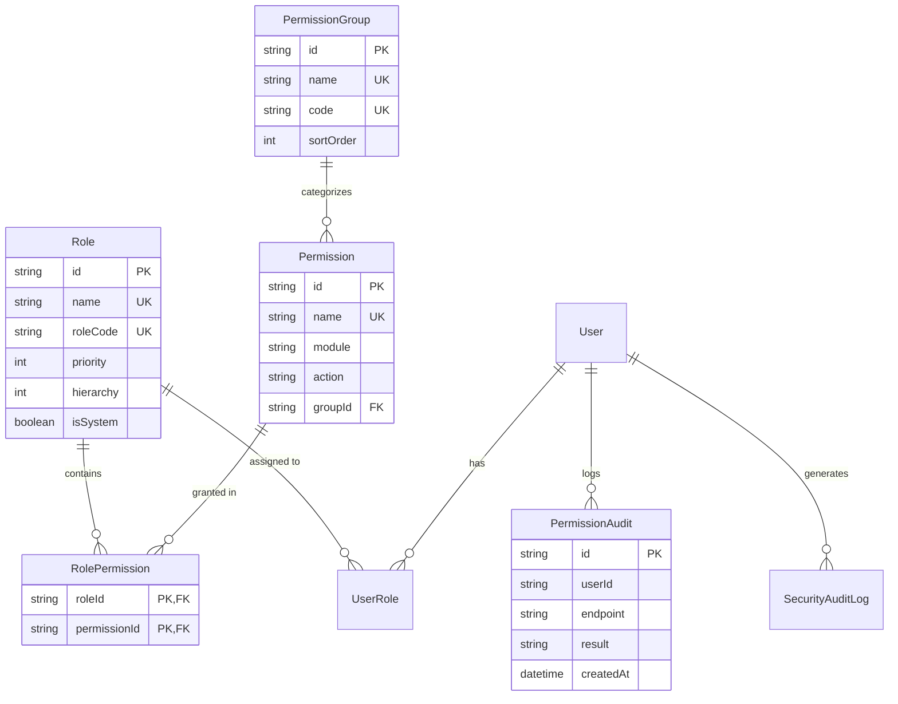

# Phase 1 – Database Report: Enterprise RBAC Tables & Relations

## Overview
This document provides the complete technical specifications for all database tables, columns, indexes, and foreign key relationships supporting Enterprise RBAC.

---

## Entity Relationship Diagram (Mermaid)

---

## Complete Table Specifications

### 1. `roles`
- `id` (UUID, PK)
- `name` (String, Unique) — Role display name (e.g. `Super Admin`, `Principal`, `HOD`)
- `roleCode` (String, Unique) — Machine identifier (e.g. `SUPER_ADMIN`, `HOD`)
- `priority` (Integer) — Display sorting index
- `hierarchy` (Integer) — Security level (1 = Super Admin, 11 = Parent)
- `isSystem` (Boolean) — Protected system roles

### 2. `permission_groups`
- `id` (UUID, PK)
- `name` (String, Unique) — Human-readable group name (e.g. `Attendance`)
- `code` (String, Unique) — Upper-case code (e.g. `ATTENDANCE`)
- `sortOrder` (Integer) — UI order (1..21)

### 3. `permissions`
- `id` (UUID, PK)
- `name` (String, Unique) — Permission string (e.g. `students:view`, `marks:approve`)
- `module` (String) — Module code
- `action` (String) — VIEW, CREATE, UPDATE, DELETE, APPROVE, REJECT, EXPORT, DOWNLOAD, ASSIGN, MANAGE
- `groupId` (UUID, FK -> permission_groups.id)

### 4. `role_permissions`
- Composite Primary Key (`roleId`, `permissionId`)
- Foreign Key `roleId` -> `roles.id` (CASCADE DELETE)
- Foreign Key `permissionId` -> `permissions.id` (CASCADE DELETE)

### 5. `permission_audits`
- `id` (UUID, PK)
- `userId` (String) — User identifier
- `endpoint` (String) — Request method and route (e.g. `POST /api/students`)
- `result` (String) — `DENIED` or `GRANTED`
- `reason` (String) — Failure detail
- `createdAt` (Timestamp)
