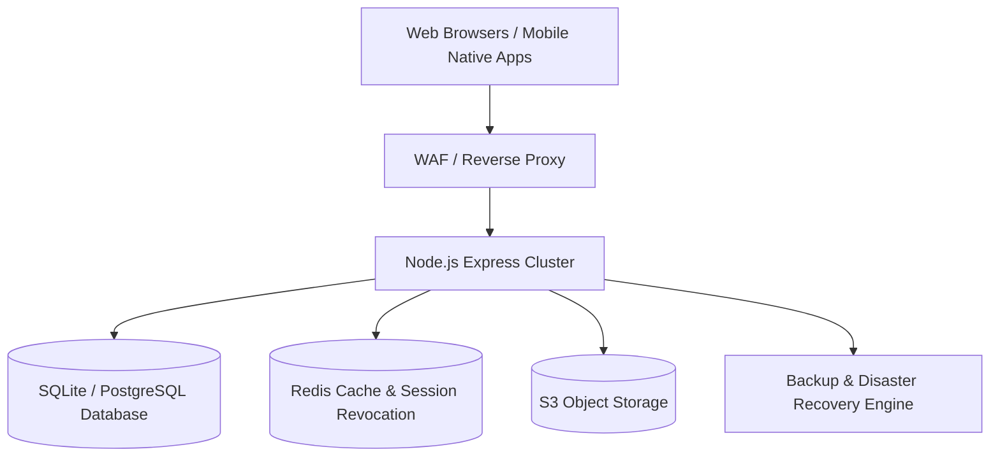

# Phase 10 – Production Readiness Architecture Report

## Executive Summary
This document specifies the high-availability production architecture, scalability model, and security controls for GEETORUS CAMPUSOS.

---

## 1. Production Topology

---

## 2. Scalability Targets
- **Target Concurrent Users**: 1,000+ active users
- **High-Load Peaks**: Attendance submission, exam result publication, circular broadcasts
- **P95 Latency Goal**: < 500 ms for API endpoints
