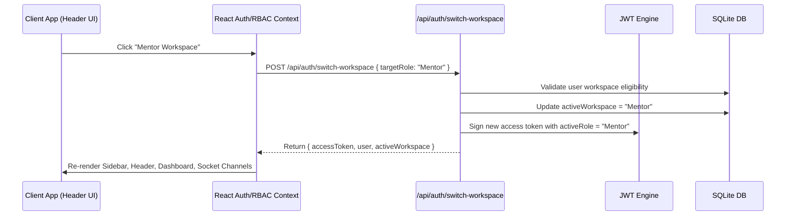

# Phase 2 – Multi-Workspace Architecture Report

## Executive Summary
This report documents the architectural design and implementation details of the **Multi-Workspace Architecture & Context Switcher Engine** in GEETORUS CAMPUSOS.

---

## 1. Overview & Business Problem
In higher education enterprise software, executive staff often perform compound roles:
- **Faculty** members also act as **Mentors** or **Class Advisors**.
- **Department Heads (HODs)** teach courses as **Faculty** while managing departmental budgets and approvals as **HOD**.
- **Vice Principals** act as **Acting Principal** during Principal offline failover.

Without a multi-workspace engine, users would need multiple user accounts or perform frequent logouts/logins. Phase 2 introduces seamless **in-session role context swapping** without re-authentication.

---

## 2. System Architecture

---

## 3. Data Model Extensions

### `User` Table
- `workspaces` (JSON String): List of authorized role workspaces (e.g. `["Faculty", "Mentor"]`).
- `activeWorkspace` (String): Active role context (e.g. `"Mentor"`).

---

## 4. Key Architectural Guarantees
1. **Zero Re-Authentication**: Session remains valid throughout workspace swaps.
2. **Context Scope Enforcement**: Every HTTP request passes `X-Active-Role` header, forcing server-side middleware to scope permissions to the active workspace.
3. **Instant UI Synchronization**: Sidebar tabs, permissions, and dashboard widgets adapt instantly without hard browser reloads.
