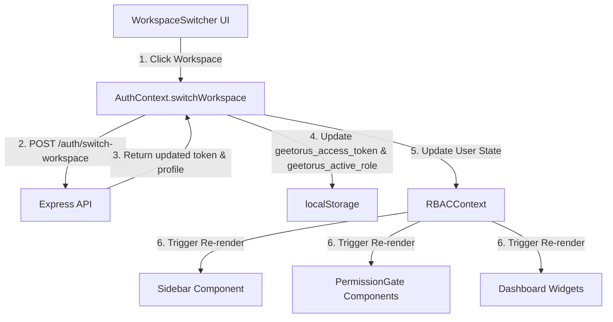

# Phase 2 – Client Synchronization Report

## Overview
This document explains how frontend components (Header, Sidebar, Navigation, Dashboard) synchronize state upon workspace context switching in GEETORUS CAMPUSOS.

---

## Client Synchronization Architecture

---

## Synchronized Elements

| Element | Triggered Action |
|---|---|
| **Header Badge** | Displays active workspace name (e.g., `Faculty Workspace` or `Mentor Workspace`) |
| **Sidebar Menu** | Dynamically filters navigation links based on active workspace permissions |
| **PermissionGate Components** | Re-evaluates visible buttons, actions, and tabs |
| **Dashboard Widgets** | Loads dashboard layout configured for the active role |
| **Socket Channels** | Subscribes real-time notifications to active role event room |
