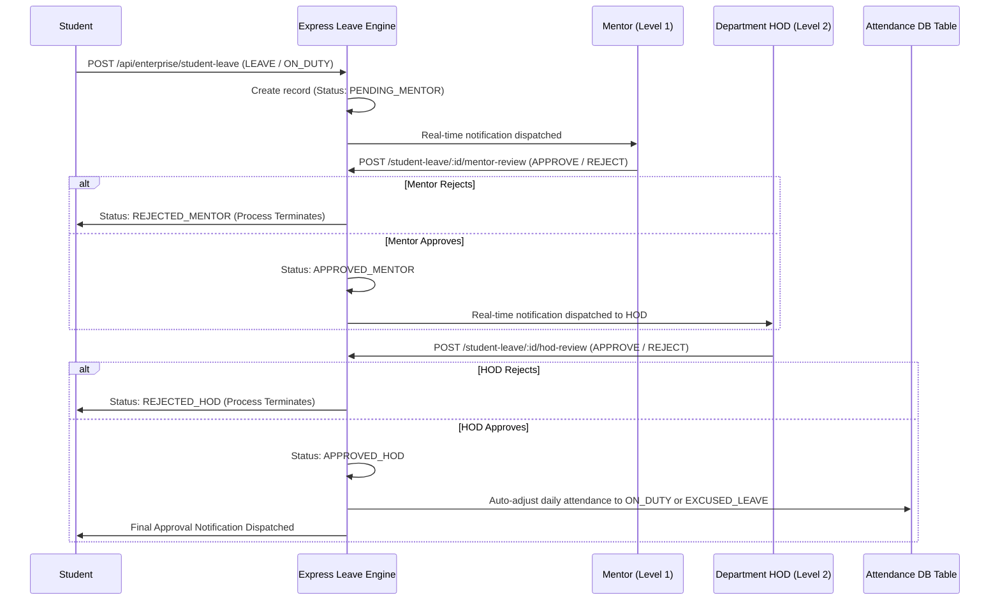

# Phase 3 – Student Leave & OD Workflow Architecture Report

## Executive Summary
This document specifies the multistage approval architecture for **Student Leave & On-Duty (OD)** requests in GEETORUS CAMPUSOS.

---

## 1. Multistage Approval Sequence

---

## 2. Status Lifecycle Matrix

| Status | Stage | Actor | Description |
|---|---|---|---|
| `PENDING_MENTOR` | Initial Submission | Student | Submitted, awaiting Level 1 Mentor review |
| `APPROVED_MENTOR` | Level 1 Endorsed | Mentor | Endorsed by Mentor, forwarded to HOD for final sign-off |
| `REJECTED_MENTOR` | Level 1 Rejected | Mentor | Rejected by Mentor, process halted |
| `APPROVED_HOD` | Level 2 Final Approval | HOD | Approved by HOD, triggers automatic attendance adjustment |
| `REJECTED_HOD` | Level 2 Rejected | HOD | Rejected by HOD, process halted |
