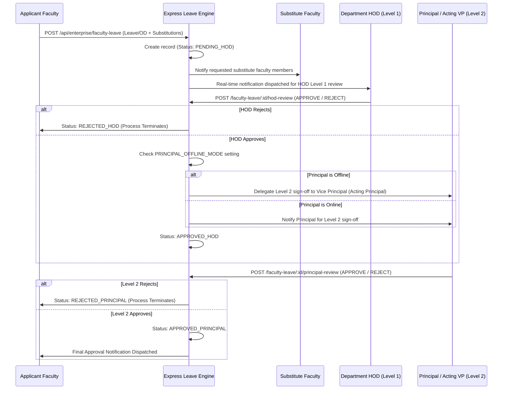

# Phase 4 – Faculty Leave & OD Workflow Architecture Report

## Executive Summary
This document specifies the multistage approval architecture for **Faculty Leave & On-Duty (OD)** requests in GEETORUS CAMPUSOS.

---

## 1. Multistage Approval Sequence

---

## 2. Status Lifecycle Matrix

| Status | Stage | Actor | Description |
|---|---|---|---|
| `PENDING_HOD` | Initial Submission | Faculty | Submitted with substitute allocations, awaiting Level 1 HOD review |
| `APPROVED_HOD` | Level 1 Endorsed | HOD | Endorsed by HOD, forwarded to Principal (or Acting Principal) |
| `REJECTED_HOD` | Level 1 Rejected | HOD | Rejected by HOD, process halted |
| `APPROVED_PRINCIPAL` | Level 2 Final Approval | Principal / VP | Approved by Principal or Acting Principal |
| `REJECTED_PRINCIPAL` | Level 2 Rejected | Principal / VP | Rejected by Principal or Acting Principal |
