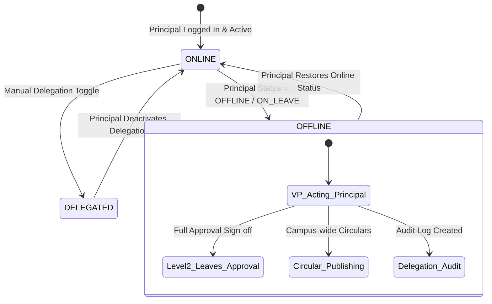

# Phase 5 – Principal Failover Architecture Report

## Executive Summary
This document specifies the system architecture for **Principal Online/Offline Failover & VP Delegation Service** in GEETORUS CAMPUSOS.

---

## 1. Failover State Architecture

---

## 2. Status Matrix & Authority Routing

| Status | Active Sign-Off Authority | Target Role | Audit Flag |
|---|---|---|---|
| `ONLINE` | Principal | `Principal` | Standard Sign-off |
| `OFFLINE` | Vice Principal (Acting Principal) | `Vice Principal` | `isActingPrincipal = true` |
| `ON_LEAVE` | Vice Principal (Acting Principal) | `Vice Principal` | `isActingPrincipal = true` |
| `DELEGATED` | Vice Principal (Acting Principal) | `Vice Principal` | `isActingPrincipal = true` |
