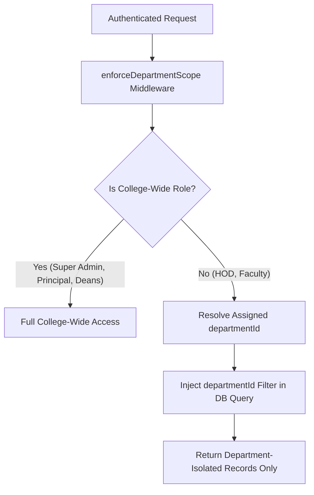

# Phase 6 – Department Isolation Architecture Report

## Executive Summary
This document specifies the system architecture for **Department Data Isolation** and the **Circular Management Engine** in GEETORUS CAMPUSOS.

---

## 1. Multi-Tenant Department Isolation Architecture

---

## 2. Scoping Rules by Role

| Role | Scope Rule | Isolation Level |
|---|---|---|
| **Super Admin** | No restriction | Global |
| **Principal / VP** | No restriction | Campus-Wide |
| **Academic / Admin / IQAC Deans** | No restriction | Executive Scope |
| **HOD** | Scoped to assigned `departmentId` | Department Level |
| **Faculty** | Scoped to assigned `departmentId` & assigned classes | Class/Dept Level |
| **Student** | Scoped to own profile & department circulars | Self/Dept Level |
