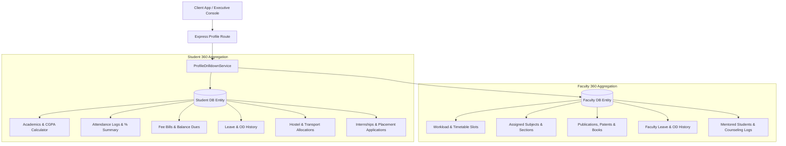

# Phase 7 – Profile Drill-Down Architecture Report

## Executive Summary
This document specifies the system architecture for **Deep Profile Drill-down & 360° Profile Aggregation Engine** in GEETORUS CAMPUSOS.

---

## 1. 360° Profile Aggregation Architecture

---

## 2. Aggregation Scope Matrix

| Metric Domain | Student 360 Scope | Faculty 360 Scope |
|---|---|---|
| **Identity & Core** | Admission No, Bio, User Profile, Parent Contacts | Employee ID, Designation, Department, Qualifications |
| **Academics** | Marks, SGPA/CGPA Calculation, Submissions | Assigned Subjects, Sections, Timetable slots |
| **Attendance** | Total Classes, Present, OD, Excused %, Absent | Class Attendance Recording History |
| **Leaves & OD** | Multistage Student Leave & OD History | Multistage Faculty Leave & OD History |
| **Finance / Research** | Fee Bills, Paid Amount, Balance Dues | Publications, Patents, Books, Certifications |
| **Campus Facilities** | Hostel Building, Room No, Transport Route | Office Room, Office Extension |
