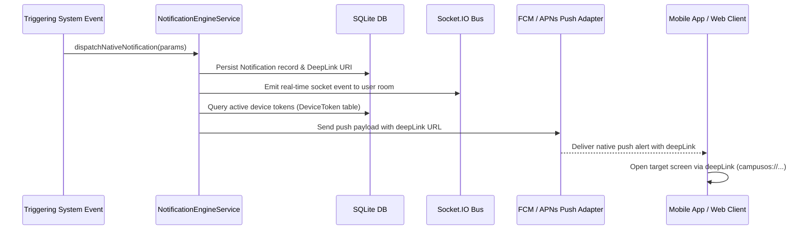

# Phase 8 – Native Notification Architecture Report

## Executive Summary
This document specifies the system architecture for **Native Push Notifications & Deep-Link Routing** in GEETORUS CAMPUSOS.

---

## 1. Native Push Notification Architecture

---

## 2. Notification Delivery Tiers

| Delivery Channel | Protocol | Delivery Target | Latency |
|---|---|---|---|
| **IN_APP** | Persistence DB Query | React Web ERP Portal | Instant |
| **SOCKET_EVENT** | Socket.IO Event Bus | Web & Mobile Sockets | < 100ms |
| **PUSH** | FCM / APNs Provider | iOS & Android Apps | Real-time |
