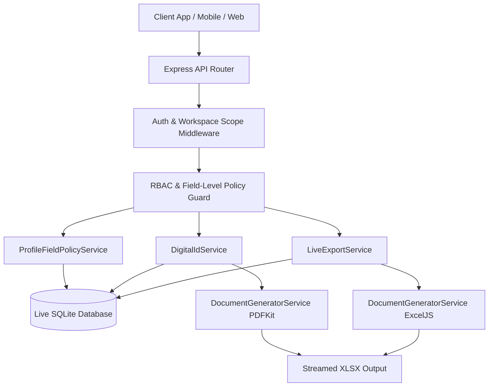

# Phase 8 – Profile Architecture Report

## Executive Summary
This document specifies the system architecture for **Deep Profile Drill-Down, Live Data Exports, Digital ID & Secure Document Generation Platform** in GEETORUS CAMPUSOS.

---

## 1. System Architecture Diagram

---

## 2. Dynamic Scope Resolution
- User authentication & role verification
- Active workspace context resolution (`X-Active-Role`)
- Department isolation scoping (`departmentId`)
- Live DB record query execution at generation time
- Redaction of sensitive fields prior to rendering
