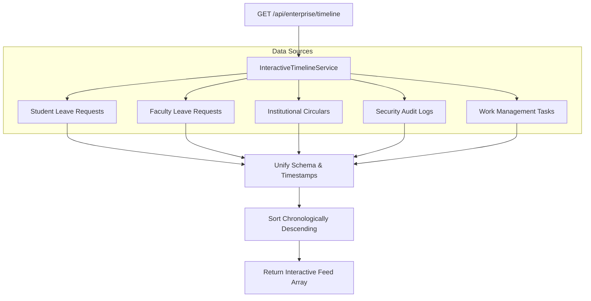

# Phase 8 – Interactive Timeline Architecture Report

## Overview
This document specifies the unified event aggregation architecture for the Interactive Activity & Audit Timeline in GEETORUS CAMPUSOS.

---

## 1. Timeline Aggregation Pipeline

---

## 2. Event Category Matrix

| Category Code | Display Name | Icon Type | Primary Actor |
|---|---|---|---|
| `STUDENT_LEAVE` | Student Leave Request | `Calendar` | Applicant Student |
| `FACULTY_LEAVE` | Faculty Leave Request | `Briefcase` | Applicant Faculty |
| `CIRCULAR` | Institutional Circular | `Bell` | Author / Executive |
| `SECURITY_AUDIT` | Security & Access Log | `Shield` | Target User / IP |
| `TASK` | Work Management Task | `CheckSquare` | Assignee / Creator |
