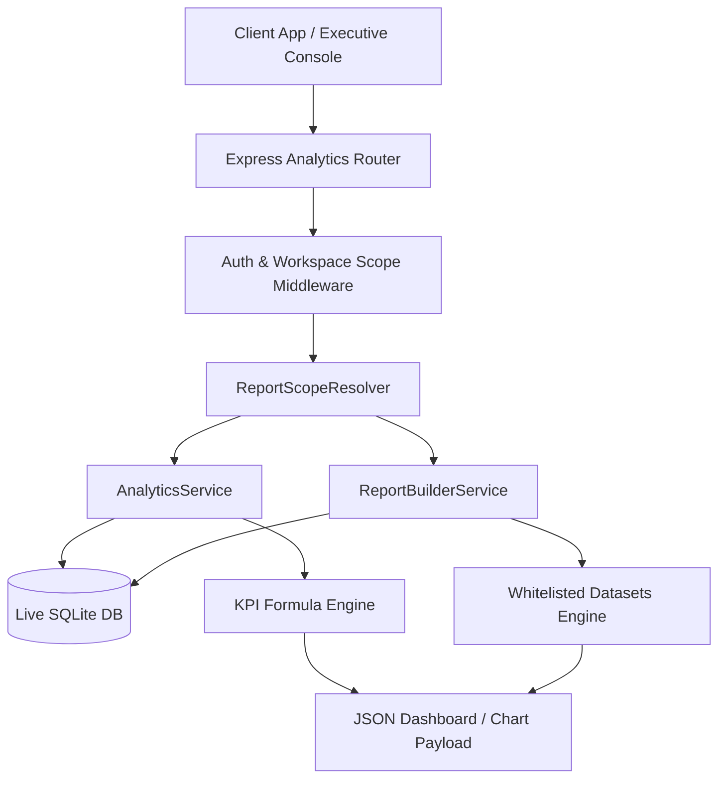

# Phase 9 – Analytics Architecture Report

## Executive Summary
This document specifies the system architecture for **Enterprise Reports, Analytics Dashboards & Role-Based Report Builder Platform** in GEETORUS CAMPUSOS.

---

## 1. Reporting Architecture Diagram

---

## 2. Security Principle
- All analytics metrics are computed strictly on the backend via live database queries.
- Raw records are never leaked to client apps for frontend calculation.
